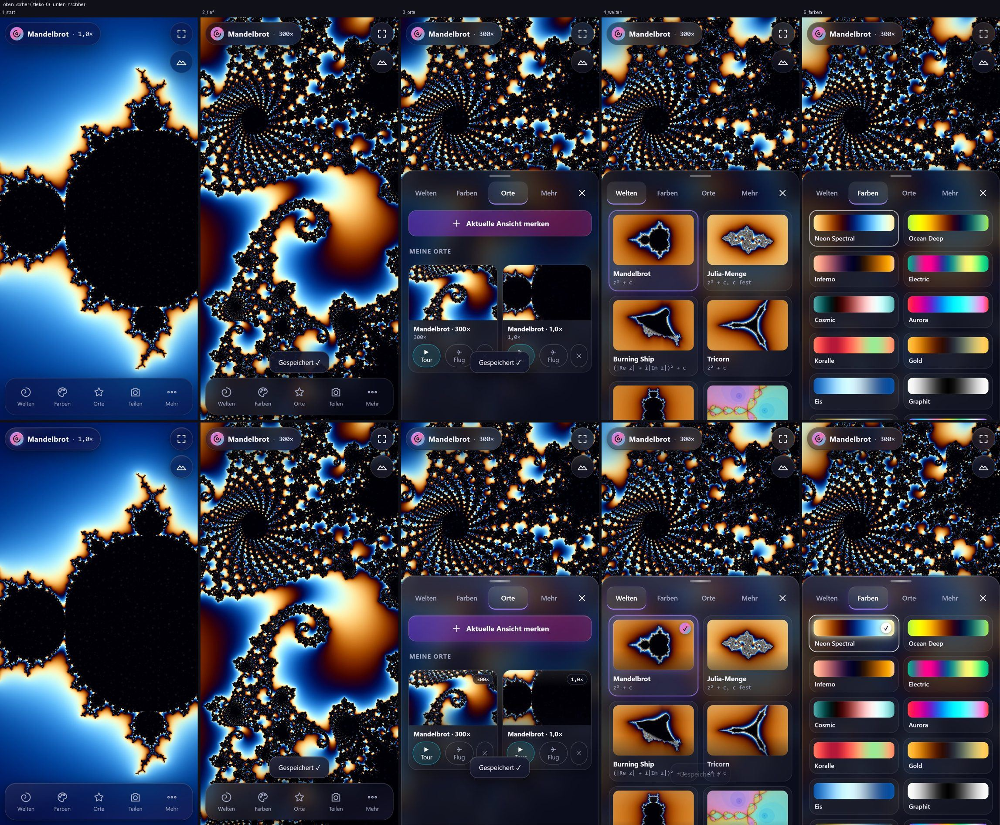
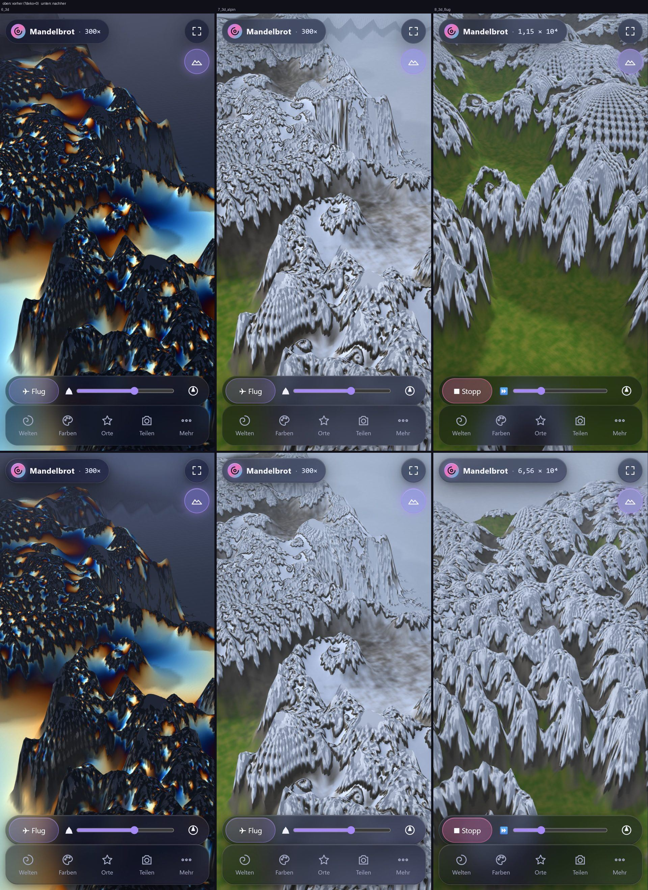
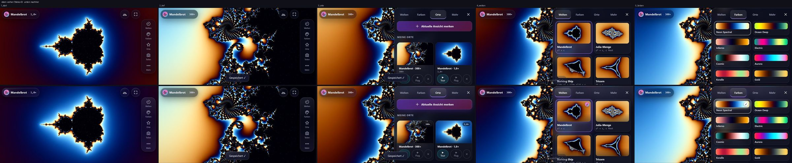
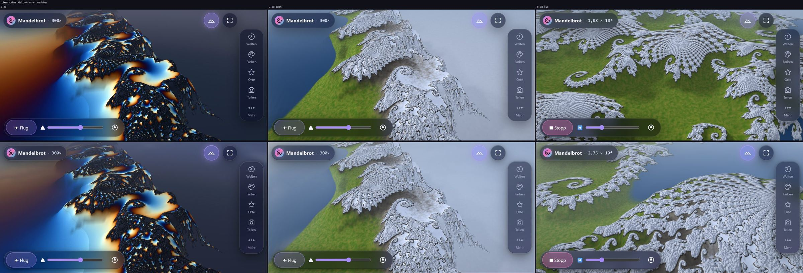

# Fraktal-Explorer 6.5 – Bericht „Verschönerung: mehr Details und Eye Candy, ressourcenschonend“

Datum 05.10.2026, gebaut und gemessen auf **rog17** (Windows 11, Ryzen 9 6900HX, RTX 3070 Ti, Chromium mit
ANGLE/Direct3D 11 wie Chrome dort). Auftrag: Peters Wunsch vom 05.10. (06:30): „Jedes Spiel mit Opus max
ressourcenschonend verschönern … also mehr Details und Eye Candy.“ Vorgaben: Mathematik und 2D-Bilder pixelgleich,
3D-Start ohne zusätzliche Shader-Programme, am Handy nicht langsamer, das alte Aussehen bleibt per **`?deko=0`**.

**A/B am Handy:** https://drpeterkalmar.github.io/Fraktale/ (neu) gegen
https://drpeterkalmar.github.io/Fraktale/?deko=0 (Aussehen bis 6.4.1). PWA: App einmal ganz schließen und neu öffnen,
unter „Mehr“ steht dann 6.5.1.

## 1. Kurzfassung (Alltagssprache)

- **Bedienung (6.5.0, live seit 19:45):** Die Glasflächen haben jetzt eine Lichtkante wie echtes Glas, das Menü
  unten hat eine leuchtende Oberkante, unter dem gewählten Reiter gleitet ein Leuchtbalken mit, unter dem aktiven
  Dock-Knopf sitzt ein Leuchtpunkt. Wechselt man Welt, Palette, Mengenfarbe oder Look, **blendet das Bild weich über**,
  statt hart umzuspringen. „Ansicht merken“ **blitzt kurz wie ein Foto** und die neue Karte springt herein. Ist ein
  Bild nach längerem Rechnen fertig, läuft ein **Lichtschweif über die Anzeige oben**. Die Orte-Karten zeigen den Zoom
  als Glas-Plakette auf dem Bild, gewählte Welt und Palette tragen ein Häkchen, die gewählte Palette leuchtet in ihrer
  eigenen Farbe.
- **3D-Landschaft (6.5.1):** **Wolkenschatten** ziehen langsam über die Berge und haften dabei am Fraktal (sie
  schwimmen beim Zoomen und Schwenken nicht). Die Ferne bekommt **Luftperspektive** (blasser, kühler) und in Senken
  leichten Talnebel; der Dunst ist zur Sonne hin warm und auf der Gegenseite kühl – die flache graue „Wand“ am
  Horizont ist weg. Über dem Horizont stehen Wolkenfelder mit Horizontleuchten in Sonnenrichtung, und **die Wolken
  spiegeln sich in den Seen** (auch im Alpin-See).
- **Kosten:** Bedienung nur CSS-Schichten und einmalige Übergänge, kein Dauer-Loop, gleicher Blur. 3D: dieselben
  Shader-Programme wie bisher (keins dazu), etwas mehr Rechnung pro Bild; bei „Akku“ und während die automatische
  Auflösungs-Drosselung greift, ist alles aus (dann exakt Bild und Kosten wie 6.4.1). Ladegröße +5,1 KB (gzip).
  Mathematik, Rechen-Shader und 2D-Bild unverändert.

_(Messung, Collagen und Tests: Abschnitte 3–5)_

## 2. Ist-Rundgang und Liste (sortiert nach Wirkung pro Kosten)

Rundgang vorher (`tests/shots/deko/vorher_*.jpg`, Pixel-7-Ansicht hoch und quer: Start, Seepferdchen-Tal 2D, Orte,
Welten, Farben, 3D Standard, 3D Alpin-See, 3D-Flug), selbst angesehen. Was flach oder leer wirkte:
- **3D-Himmel/Ferne:** einfarbiger grau-blauer Verlauf, im Alpin-Look eine weiß-graue Dunstwand über der halben
  Bildfläche; See als flache dunkle Fläche ohne Spiegelbild; keine Bewegung außer Wellen.
- **Bedienung:** solides Glas, aber flach (keine Lichtkante); Reiter springen hart um; Welt-/Farbwechsel springen
  hart; „Ansicht merken“ gibt nur einen Toast; auf den Orte-Karten steht der Zoom doppelt (Name und Zeile darunter).

| # | Verschönerung | Wirkung | Kosten | Stand |
|---|---|---|---|---|
| 1 | Weiche Überblendung bei Welt/Palette/Mengenfarbe/Look | hoch | einmalig 0,4–0,65 s, ein Schnappschuss | **umgesetzt (6.5.0)** |
| 2 | Glas mit Lichtkante, leuchtende Sheet-Oberkante, Glas-Toast | hoch | nur CSS, gleicher Blur | **umgesetzt (6.5.0)** |
| 3 | Gleitender Leuchtbalken unter dem Reiter, Leuchtpunkt im Dock | mittel | CSS-Übergang (Compositor) | **umgesetzt (6.5.0)** |
| 4 | Rückmeldung: Foto-Blitz + Karte springt herein; Lichtschweif am HUD, wenn ein Bild fertig ist | mittel | einmalige CSS-Animation | **umgesetzt (6.5.0)** |
| 5 | Karten: Bild mit Tiefe, Zoom-Plakette, Häkchen, Palette leuchtet | mittel | nur CSS | **umgesetzt (6.5.0)** |
| 6 | Sanfter Start (Bild blendet aus dem Dunkel auf) | klein | einmalig 0,9 s | **umgesetzt (6.5.0)** |
| 7 | Luftperspektive + Talnebel + warmer/kühler Dunst | hoch | wenige Rechenschritte pro Pixel | **umgesetzt (6.5.1)** |
| 8 | Wolkenschatten, am Fraktal verankert, ziehen mit dem Wind | hoch (bewegt) | pro Gitterpunkt (~20 000 statt ~1 Mio. Pixel) | **umgesetzt (6.5.1)** |
| 9 | Wolken im Himmel + Horizontleuchten + Sonnenhof | mittel (Himmel bei 42–60° Neigung nur als Streifen sichtbar) | Himmels-Pass, 4 Oktaven | **umgesetzt (6.5.1)** |
| 10 | Wolken spiegeln sich im See / Alpin-See | mittel | nur auf Wasserpixeln, 3 Oktaven | **umgesetzt (6.5.1)** |
| 11 | Partikel (Schneefall/Pollen im Flug, Funken beim Merken) | mittel | Partikel-Pool | offen |
| 12 | Ferne Bergkette (Impostor) gegen die Dunstwand im Alpin-Look | hoch | eigener Pass | offen |

Bewusst nicht: Vollbild-Bloom, SSAO, Echtzeit-Schatten, eine Vignette über dem 2D-Bild (2D bleibt pixelgleich),
stärkerer Blur (der Hintergrund-Blur ist am Handy der teuerste Teil des Glases).

## 3. Messung vorher/nachher (rog17/RTX 3070 Ti – nicht mit den M1-Werten früherer Berichte vergleichbar)

Skript `tests/deko_tour.py perf`: Pixel-7-Ansicht hoch, **CPU 4× gedrosselt** (CDP `Emulation.setCPUThrottlingRate`),
Farbanimation an (Alltag), je Szene 10–12 s Bildzeiten aus `requestAnimationFrame`; Zeichenaufrufe, Dreiecke und
Texturen pro Bild über einen Zähler an `WebGL2RenderingContext` (die App nutzt kein three.js, darum kein
`renderer.info`). Vorher = 6.4.1, nachher = 6.5.1. Rohdaten `tests/results_deko_{vorher,nachher}.json`.

| Szene | Bildzeit p50 vorher → nachher | p95 vorher → nachher | max | Aufrufe/Bild | Dreiecke/Bild | Texturen |
|---|---|---|---|---|---|---|
| 2D, Farben-Tab offen (Glas über laufender Farbanimation) | 16,7 → 16,7 ms | 16,7 → 16,8 ms | 16,8 → 16,8 | 1 → 1 | 1 → 1 | 25 → 21 |
| 3D Stillstand (Standard) | 16,7 → 16,7 | 16,7 → 16,8 | 16,8 → 16,8 | 2,1 → 2,1 | 28 167 → 28 121 | 31 → 31 |
| 3D-Flug | 16,7 → 16,7 | 16,7 → 16,7 | 50 → 16,8 | 3,7 → 3,6 | 56 319 → 56 319 | 32 → 34 |
| 3D Alpin-See | 16,7 → 16,7 | 16,8 → 16,8 | 50 → 49,9 | 2,1 → 2,1 | 28 450 → 28 544 | 32 → 32 |
| 3D-Flug, Qualität „Akku“ (niedrigste Stufe, Deko in 3D aus) | 16,7 → 16,7 | 16,7 → 16,7 | 16,8 → 16,8 | 3,7 → 3,7 | 21 665 → 21 665 | 37 → 37 |

- **Budget eingehalten:** p95 gleich (Ziel ≤ +10 %), auf „Akku“ gleich. Allerdings hält die RTX auch gedrosselt
  überall den 60-Hz-Takt – kleine GPU-Mehrkosten sieht man in der Bildzeit hier nicht. Darum zusätzlich die GPU-Zeit
  pro 3D-Bild (Timer-Abfrage, `tests/deko_tour.py gpu`, Minimum aus 3 × 12 Bildern):

| GPU-Zeit pro 3D-Bild (ms, Minimum) | 6.4.1 | 6.5.1 | A/B gleiche Version: `?deko=0` Lauf 1 / 2 | Deko an Lauf 1 / 2 |
|---|---|---|---|---|
| Standard, Bewegungsbild (65 %) | 1,79 | 1,41 | 1,79 / 1,36 | 1,80 / 1,13 |
| Standard, Stillbild (voll, Mittelung) | 3,31 | 2,94 | 3,72 / 2,77 | 3,30 / 3,25 |
| Alpin-See, Bewegungsbild | 2,21 | 2,92 | 1,89 / 1,73 | 1,87 / (0,37¹) |
| Alpin-See, Stillbild | 4,39 | 3,34 | 3,73 / 3,59 | 3,54 / (0,74¹) |

¹ Ausreißer (Szene offenbar noch nicht aufgebaut), nicht gewertet. **Ergebnis:** Die Unterschiede an/aus liegen
innerhalb der Streuung zwischen zwei gleichen Läufen (bis ±25 % – die Laptop-GPU wechselt ihre Taktstufen); die
Mehrkosten der 3D-Deko sind auf der RTX nicht messbar. Rechnerisch klein: Himmel 4 Rausch-Oktaven nur über dem
Horizont, Gelände wenige Rechenschritte pro Pixel, Wolkenspiegelung nur auf Wasserpixeln, Wolkenschatten pro
Gitterpunkt. **Am Handy nicht gemessen** – dort bitte auf Flüssigkeit und Wärme achten (Abschnitt 6); bei „Akku“ ist
die 3D-Deko aus, und sobald die automatische Auflösungs-Drosselung greift, blendet sie sich ab (dann Bild und Kosten
exakt wie 6.4.1). Rohdaten `tests/results_deko_gpu_*.json`.

- **Ladegröße** (alle Dateien aus `sw.js` + `index.html` + `sw.js`, gzip): 609 388 → 614 501 Byte (**+5,1 KB**, Budget
  +1 MB). Keine neuen Dateien, keine externen Anfragen, offline wie bisher (Release-Test mit Service Worker + offline
  neu laden grün).
- **3D-Start:** keine zusätzlichen Shader-Programme (Himmel und Gelände sind dieselben Programme, nur etwas länger).
  `test_v63` (langsamer Treiber simuliert: nicht blockierend, 2D bleibt bedienbar, nur Gelände-Variante 0 übersetzt,
  Look-Wechsel ohne Block) grün.
- **Leerlauf/versteckter Tab:** Überblendung, Blitz, Lichtschweif und Kartensprung sind einmalige CSS-Übergänge; der
  Wolkenzug läuft nur, solange ohnehin animiert gezeichnet wird (Farbanimation an), sonst steht er – die GPU ruht wie
  bisher. `prefers-reduced-motion`: Blitz aus, Überblendung 0,15 s, Wolken stehen, CSS-Animationen wie bisher aus.

## 4. Vorher/Nachher-Collagen (oben `?deko=0` bzw. 6.4.1, unten 6.5.1)

Einzelbilder: `tests/shots/deko/{vorher,nachher}_{hoch,quer}_*.jpg`. **Ehrliche Bewertung (selbst angesehen):**
- *Bedienung:* deutlich hochwertiger – Glas mit Licht, Reiter mit gleitendem Leuchtbalken, Karten mit Plakette und
  Häkchen. Das 2D-Fraktalbild ist unverändert (Spalte „2_tief“ identisch).
- *Weiche Übergänge:* auf Standbildern nicht zu sehen; im Test geprüft (Überblendung läuft 0,4–0,65 s und wird
  danach freigegeben; mit `?deko=0` kein Schnappschuss).
- *3D:* **dezent, nicht spektakulär.** Mehr Tiefe in der Ferne (blasser, kühler), warmes Licht im Dunst zur Sonne,
  weiche Wolkenschatten auf Hängen und Matten. Der Himmel ist bei der üblichen Neigung (42–60°) nur ein schmaler
  Streifen, die Wolken dort sieht man selten; ihre Spiegelung im See ist bei Aufsicht schwach. Die weiß-graue
  Dunstwand im Alpin-Look (Querformat) ist etwas lebendiger getönt, aber noch da (siehe offen, Punkt 12).
  Flug-Bilder (Spalte 3) zeigen verschiedene Flugmomente und sind nicht direkt vergleichbar.
- Nach den Aufnahmen und Messungen noch zwei kleine Korrekturen (aus `test_v62`): Wolkenspiegelung bei Aufsicht
  schwächer (ein schwarz gewählter See bleibt dunkel), kein Talnebel über Schnee/Gletscher. Gleiche Rechenmenge.

## 5. Tests (rog17, Chromium + ANGLE/D3D11, dauerhaftes Testprofil mit Shader-Cache)

Etappe 1 (6.5.0) gegen einen eingefrorenen Stand, Etappe 2 (6.5.1) ebenso (eigener Worktree + Port):

| Test | 6.5.0 | 6.5.1 | Bemerkung |
|---|---|---|---|
| `node tests/node_core_test.js --quick` | grün | (Kern unverändert) | ALL PASS |
| `test_release` (Versionen, Cache-Busting, Service Worker, offline) | grün¹ | grün | ¹ erster Lauf fand `?v=6.4.1` im Manifest → behoben |
| `test_ui`, `test_features` | grün | (Bedienung in 6.5.1 unverändert) | |
| `test_gestures` | grün² | – | ² HUD beim Stabilitäts-Hash maskiert (Lichtschweif) |
| `test_blend` | 3 Punkte rot | – | **genauso rot mit unverändertem 6.4.1 am rog** (Long Tasks 125–134 ms unter D3D11, Tempo-Bremse greift auf der RTX nicht: 0,94–0,97) → Rechner-Eigenheit, kein Deko-Effekt |
| `test_truth` GPU (16 Ansichten × 400) | – | grün | alle okPct identisch mit den Mac-Referenzwerten (`results_truth_gpu_metal.json`) |
| `test_3d` (u. a. 2D nach 3D an/aus pixelgleich) | – | grün | |
| `test_v63` (3D-Start nicht blockierend, langsamer Treiber simuliert) | – | grün | |
| `test_smooth` (Glättung 6.1) | – | grün | |
| `test_v64` (Bunte Menge) | – | 1 Punkt rot³ | ³ alle Rechen-/Bedienprüfungen grün; „3D mit Bunt“ wartet nur ~3,5 s auf 3D – unter FXC braucht die geänderte Bunt-Variante beim ersten Übersetzen länger (siehe unten) |
| `test_v64` Wiederholung (Shader-Cache angewärmt) | – | grün | 3D mit Bunt: Variante `t3terrB`; gezielt geprüft: übersetzt fehlerfrei, 3D nach 4,7 s (kalt) bzw. 3,9 s |
| `test_v62` (Mengenfarbe, Alpin, Flug am Rand) | – | grün (nach Korrektur; Abstand 256, knapp) | „Weiß wirkt in 3D“: die Wolkenspiegelung hellte den schwarzen See auf und der Talnebel legte sich auf den Gletscher (Abstand 211 bzw. 250, gefordert > 250) → Spiegelung bei Aufsicht schwächer, kein Nebel über Schnee/Gletscher; Flugteil (Lenkung, Rand, Wischen) grün |
| `test_fly64` (Flug bei 15 fps, hoch + quer) | – | grün | |
- Live-Rauchtests (github.io, mit und ohne `?deko=0`): 6.5.0 um 19:47 (Palettenwechsel) und 6.5.1 um 20:29 (Palettenwechsel + 3D): richtige Version, 3D an, 0 Fehler.

## 6. Worauf Peter am Handy achten soll

1. **Farben-Tab:** Palette antippen → das Bild soll weich überblenden (kein harter Sprung). Gleiches bei Welten,
   Farbe der Menge, Inseln/Ringe, Alpin-Look und Tal.
2. **Reiter im Menü:** der Leuchtbalken gleitet unter den gewählten Reiter; unten im Dock ein Leuchtpunkt.
3. **Orte → „Aktuelle Ansicht merken“:** kurzer Foto-Blitz, die neue Karte springt herein, Zoom als Plakette auf dem Bild.
4. **Nach dem Zoomen warten, bis das Bild fertig ist:** ein Lichtschweif läuft einmal über die Anzeige oben links.
5. **3D (⛰), Flug (✈):** Wolkenschatten ziehen langsam über die Berge und bleiben beim Zoomen am Gelände; die Ferne
   ist dunstiger und zur Sonne hin warm. Bitte darauf achten, ob es **flüssig wie vorher** bleibt und das Handy
   nicht wärmer wird. Wenn es ruckelt: unter „Mehr → Auflösung → Akku“ ist die 3D-Deko komplett aus.
6. **A/B:** dieselbe Stelle mit `…/Fraktale/?deko=0` (altes Aussehen) vergleichen.

## 7. Offen / Hinweise

- **Offen:** Partikel (z. B. Schneefall im Alpin-Flug), ferne Bergkette gegen die Alpin-Dunstwand, Vorschaubilder
  der Welten neu rendern (die Karten nutzen die vorhandenen Bilder). Im Zeitfenster bis 21:00 nicht mehr begonnen.
- **Messwerte** stammen vom rog (RTX 3070 Ti), die Bildzeit klebt dort am 60-Hz-Takt; am Handy entscheidet die
  GPU-Zeit (Abschnitt 3). Ein Handy-Messwert fehlt.
- **Fund am Rande (nicht Teil des Auftrags):** Chromium mit Direct3D 11 braucht am rog beim **allerersten** Laden
  (leerer Shader-Cache) **~80 s**, bis die App steht (gemessen: Vulkan 1,4 s). Danach ist der Cache warm. Das betrifft
  auch Chrome am rog nach jedem Update mit geänderten Rechen-Shadern – wäre ein eigener Auftrag (wie 6.3 für 3D).
- **Testumgebung Windows:** `tests/e2e_lib.py` nutzt auf Windows ANGLE/D3D11 mit dauerhaftem Profil je Platz
  (Shader-Cache; Einstellungen, Service Worker und HTTP-Cache werden pro Start gelöscht, Plätze per Dateisperre
  getrennt). Mac-Verhalten unverändert (`sys.platform`-Weiche). `test_gestures` maskiert beim Stabilitäts-Hash die
  HUD-Pille (dort läuft nach dem Fertigrechnen einmal der Lichtschweif).
- **Entschuldigung:** Beim Aufräumen hängender Testbrowser habe ich um ~19:20 einmal per `taskkill` **alle**
  `chrome.exe` am rog beendet. Falls dabei ein offenes Chrome-Fenster zuging: das war ich.
