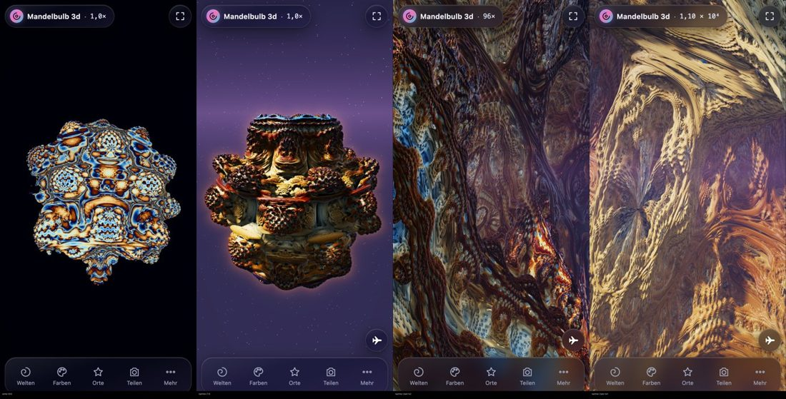

# 🌀 Fraktal-Explorer 7 – Deep Zoom fürs Handy, 3D-Landschaft und echte 3D-Fraktale

**Live:** https://drpeterkalmar.github.io/Fraktale/ · installierbar als App (PWA), funktioniert offline.

Ein Mandelbrot- und Fraktal-Explorer, der auch auf einem Mittelklasse-Android-Handy flüssig bis in Tiefen von 10³⁰ (GPU) und 10²⁹⁰ (CPU) zoomt – ohne Kachel-Aufbau, ohne Flackern, mit mathematisch geprüften Bildern. Seit 6.1 sieht die Menge aus wie in den bekannten vorgerenderten Zoom-Videos: geschlossen, ruhig, mit glattem Rand. Seit 6.2 kann sie jede Farbe haben – in 3D wird Weiß zum Gletscher, der Alpin-Look macht daraus ein Alpenpanorama mit Wald oder See im Tal – und der Flug gleitet ruhig am Mengenrand in die Tiefe. Seit 6.4 kann das Innere auch bunt sein: jede Knospe, jedes Mini-Mandelbrot in einer eigenen Farbe. Seit 6.6 fliegt der ✈ Flug auch flach in 2D – wie ein endloses Zoom-Video, das ruhig am Rand der Menge in die Tiefe taucht. Seit 6.8 auch rückwärts (auf demselben Weg wieder hinaus), und im Vollbild bleibt nur das Bild. Seit 6.8.1 fliegt der Flug ungestört durch Vollbild und Drehen, und Screenshots gibt es in beliebig hoher Auflösung (bis 1 Gigapixel, in Kacheln nahtlos gerechnet). Seit 6.9 kann das Äußere schwarz bleiben – nur grenznah leuchtend oder ganz schwarz mit bunter Menge. **Seit 7.0 ist der Mandelbulb ein echtes 3D-Fraktal-Rendering** – mit Licht, weichen Schatten, Tiefe, Materialien, frei fliegender Kamera und Zoom bis ≈ 8·10⁴ – und Mandelbox und Menger-Schwamm kommen als neue Welten dazu.

## 🖐 Gesten (Kurzanleitung)

| Geste | Wirkung |
|---|---|
| Ein Finger ziehen | verschieben – mit Schwung (Trägheit) |
| Zwei Finger spreizen/zusammenziehen | zoomen; der Punkt unter den Fingern bleibt stehen |
| Doppeltipp | hineinzoomen ×3 an dieser Stelle |
| Zwei-Finger-Tipp | herauszoomen ÷3 |
| Lange drücken (Mandelbrot) | Julia-Menge genau für diesen Punkt öffnen |
| Einmal tippen | Bedienelemente aus-/einblenden (Vollbild-Genuss); schließt offene Menüs. Im Vollbild/Kino-Modus: Bedienung für 3 s zeigen |
| Unten: **Welten · Farben · Orte · Teilen · Mehr** | Bottom-Sheet mit allen Einstellungen (Griff ziehen: groß/zu) |

## 💠 Mandelbulb, Mandelbox, Menger-Schwamm (seit 7.0)

Drei echte 3D-Fraktale (Welten-Tab), gerechnet per Raymarching mit Licht und Schatten:

| Geste | Wirkung |
|---|---|
| Ein Finger ziehen | um den Körper drehen (mit Schwung) |
| Zwei Finger spreizen/zusammen | hinein-/herauszoomen auf die Stelle unter den Fingern zu |
| Doppeltipp | zu dieser Stelle der Oberfläche fliegen (Abstand ÷ 3, Blick dreht hin) |
| Zwei-Finger-Tipp | herauszoomen ×3 |
| Lange drücken | **Julia-Bulb**: c = dieser Oberflächenpunkt (Mandelbulb, Mandelbox) |
| Tippen (Tiefenunschärfe an) | Fokus auf diese Stelle |
| ✈ | Flug durch die Strukturen (Tempo, ⏪ Rückwärts, Pause, Ziehen lenkt – wie der 2D-Flug) |
| Desktop | Ziehen/rechte Maustaste drehen, Mausrad zoomt zum Mauszeiger, Pfeile drehen, `Bild↑/↓` zoomt, `R` Startansicht, `Leertaste` Flug |

- **Licht & Material:** Hauptlicht schräg hinter der Kamera, Himmels- und Rückstreulicht, weiche Schatten, Ambient Occlusion, Glanzlicht, Fresnel-Randlicht, filmische Tonkurve. Hintergrund: Verlauf mit Sternen (oder nach **Außen**: schwarz mit Leuchten am Rand / ganz schwarz).
- **Farbe nach Struktur:** Orbit-Traps (kleinster Abstand der Bahn) wählen die Palettenfarbe – jede App-Palette inkl. eigener; Farbanimation läuft, ohne das Bild neu zu rechnen. Leuchten in Rissen und Kerben. **Stile:** Klassisch, Stein, Metall, Glas/Neon.
- **Echtes Hineinzoomen:** Treffer-Genauigkeit wächst mit dem Zoom (je Pixel), Iterationen und Schritte wachsen mit; ab Zoom ~60 wird die erste Iteration um einen Ankerpunkt entwickelt (Taylor), dadurch reicht die float32-Genauigkeit der Grafikkarte bis ≈ 8·10⁴ (ohne Anker zerfällt das Bild dort schon in Körner). Dort hält die Kamera mit Hinweis an. Menger bis ≈ 2·10⁴ und weiter, Mandelbox bis ~10³–10⁴.
- **Ruhebild:** steht die Kamera, werden 6–24 Bilder mit Subpixel-Versatz, wechselnden Schatten-/AO-Proben (und Linsenpunkten bei Tiefenunschärfe) gemittelt – nach ≈ 0,6–2 s rauscharm (gemessen M1, Mittelklasse-Profil). In Bewegung rechnet die App in angepasster Auflösung (hält ≥ 30 Bilder/s).
- **Parameter** (Welten → Mandelbulb): Exponent 2–16 stufenlos, **Atmen** (Exponent schwingt), Julia-Bulb an/aus, **Nebel**, **Tiefenunschärfe**; Mandelbox: **Skalierung** −3…3. Alles im Teilen-Link (`b=` Kamera/Parameter, `bs`/`bf`/`bd` Stil/Nebel/Unschärfe) und in „Ansicht merken“ (Rundflug landet exakt). Alte Mandelbulb-Links öffnen weiter.
- **Screenshot** in beliebiger Auflösung auch für die 3D-Fraktale: Kacheln mit verschobenem Bildausschnitt, volle Ruhebild-Qualität, bitgleich zum Bild aus einem Stück.
- Geht etwas mit der Grafik nicht (kein Float-Renderziel, Shader-Fehler): einfacher Mandelbulb wie bis 6.9 mit Hinweis. Vergleich: `?bulb=0`. Messhilfen: `?bulbslow=N` (GPU-Last ×N simulieren), `?bulbtay=0` (ohne Anker), `?bulbk=N` (Bilder im Ruhebild). Details: `V7_BERICHT.md`.

## 🏔 3D & Flug

Oben rechts **⛰ (3D-Landschaft)** antippen: die aktuelle Ansicht richtet sich als Gebirge auf – der Rand der Menge bildet die Kämme, die Menge selbst ist ein See, Farben = aktuelle Palette, Sonne mit weichen Schatten, Dunst zum Horizont. Die exakte Deep-Zoom-Rechnung bleibt dieselbe wie in 2D (die Landschaft liest nur das fertige Bild).

| Geste in 3D | Wirkung |
|---|---|
| Ein Finger ziehen | über die Landschaft schieben |
| Zwei Finger spreizen/zusammen | hinein-/herauszoomen |
| Zwei Finger drehen | Landschaft drehen |
| Zwei Finger gemeinsam hoch/runter | neigen (0–60°) |
| Doppeltipp / Zwei-Finger-Tipp | Zoom ×3 / ÷3 |
| Leiste unten: **✈ Flug**, ⛰ Höhe, 🧭 Ausrichten | Flug starten/stoppen, Bergehöhe, zurück auf Norden + Standardneigung |

**✈ Flug in 3D:** Die Kamera gleitet über die Landschaft und taucht dabei endlos in die Tiefe (Zoom + Vorwärtsflug); die Berge wirken in jeder Tiefe gleich hoch. Der **Zufallsflug** (✈ in der Leiste) gleitet seit 6.2 ruhig am Mengenrand entlang (Filamente, Spiralen, Minibrot-Ränder) – der Zoompunkt sitzt auf dem Rand, der Kurs dreht gedämpft (höchstens 17 °/s) mit leichter Schräglage; das Innere und leere Ebenen meidet er, aus einer leeren Fläche gleitet er erst zum nächsten Rand. **✈ Flug** an einem gespeicherten Ort (Orte-Tab) startet im Gesamtbild und landet exakt dort – seit 6.6 im aktuellen Modus (in 2D flach, in 3D über die Landschaft). **Tippen = Pause**, **nach links/rechts wischen = lenken**, Tempo-Regler (seit 6.8 mit Rückwärts, siehe unten). Drehrate: `?flyturn=` (rad/s). Bei den 3D-Fraktalen (Mandelbulb, Mandelbox, Menger) gibt es keinen 3D-Schalter, aber seit 7.0 einen eigenen Flug (siehe oben); Buddhabrot hat keinen Flug.
Desktop: rechte Maustaste ziehen = drehen/neigen, Shift+Pfeile = drehen/neigen, `D` = 3D an/aus, `V` = Flug (im aktuellen Modus).

**✈ Flug in 2D (seit 6.6):** Der runde **✈-Knopf** sitzt in der flachen Ansicht in der Daumenzone (hochkant unten rechts über der Leiste, quer unten links). Das Bild taucht ruhig und endlos in die Tiefe, der Zoompunkt gleitet am Mengenrand entlang (Filamente, Spiralen, Minibrot-Ränder) und die Bildmitte folgt ihm weich – ohne Berge und Neigung. Gesteuert wird mit derselben Randsuche wie in 3D, nur ohne Kurs: **Tippen = Pause**, **ein Finger ziehen = das Bild schieben** (der Flug taucht an der neuen Stelle weiter), zwei Finger beenden den Flug; im Flug zeigt die Leiste unten **■ Stopp** und das Tempo. **⛰ während des Flugs** wechselt nahtlos in den 3D-Flug, ⛰ aus im 3D-Flug fliegt flach weiter. Der 2D-Flug braucht keine 3D-Shader (nur eine kleine Sonde) und geht deshalb auch dort, wo die 3D-Landschaft nicht läuft. Er fliegt über die GPU-Tiefe 10³⁰ hinaus mit der CPU-Rechnung weiter – dort langsamer und etwas weicher. Vergleich mit 6.5 (Flug nur in 3D): `?fly2d=0`.

**⏪ Rückwärts fliegen (seit 6.8):** Der Tempo-Regler in der Flug-Leiste reicht von −1,5 bis +1,5 und rastet in der Mitte ein: **Mitte = Schweben** (das Bild steht), **links rückwärts ⏪**, **rechts vorwärts ⏩**. **⇄** wechselt die Richtung weich (das Tempo läuft in 0,6 s über 0 auf den Gegenwert, kein Ruck). Rückwärts zoomt der 2D-Flug heraus und der 3D-Flug fliegt rückwärts über die Landschaft – mit Blick nach vorn, wie ein rückwärts abgespielter Kameraflug; **↶ Umdrehen** (nur 3D) dreht den Blick um 180°. Der Rückflug nimmt **denselben Weg wie der Hinflug** (der Kurs wird mitgeschrieben); wurde unterwegs geschoben oder tief gestartet, geht es zentriert hinaus und am Ende zur Übersicht. Bei Zoom 1 (Ziel-Flug: am Start) hält er weich an – „Ganz draußen“; ⇄ fliegt wieder hinein. Gesten im Flug wie bisher. Tasten im Flug: `R` = Richtung wechseln, `↑/↓` = Tempo, `U` = Umdrehen (außerhalb des Flugs wie bisher: `R` = Zurücksetzen, Pfeile verschieben). Ohne Rückwärts (Regler 0,1–1,5 wie bis 6.7): `?rueck=0`.

**Vollbild nur mit Bild (seit 6.8):** Im Vollbild (`F` oder ⛶) verschwinden alle Bedienelemente weich – Leisten, Dock, Knöpfe, Flug-Leiste, Zoom-Anzeige, Hinweise. **Kurz tippen** (ohne Wischen) bzw. **die Maus bewegen** zeigt sie für 3 s; Zoomen, Schieben und Lenken holen sie nicht zurück, ein laufender Flug läuft weiter. `Esc`/`F` verlässt das Vollbild. Am **iPhone** (kein Vollbild für Webseiten) ist derselbe Knopf der **Kino-Modus**: gleiches Ausblenden ohne echtes Vollbild, auch in der installierten App; zum Verlassen kurz tippen und den Knopf wieder antippen. Abschaltbar unter Mehr → „HUD im Vollbild ausblenden“.

**Flug im Vollbild (seit 6.8.1):** Vollbild an/aus, Adressleiste weg und Drehen hoch/quer unterbrechen einen laufenden 2D- oder 3D-Flug nicht – er fliegt mit Kurs und Tempo weiter, ohne Ruck (beim Umschalten ist ein Flugschritt höchstens 1/30 s lang, und die Tempo-Bremse hält kurz ihren Wert, bis die neuen Ränder gerechnet sind). Auch bei ausgeblendeter Bedienung lässt sich der Flug steuern: **Leertaste = Flug an/aus**, `R` = Richtung, `↑/↓` = Tempo, `U` = Umdrehen; am Handy **Doppeltipp = Flug an/aus** (ein einfacher Tipp holt wie bisher die Bedienung, Wischen lenkt). Gilt ebenso im Kino-Modus am iPhone.

**📷 Screenshot in hoher Auflösung (seit 6.8.1):** Mehr → **Screenshot-Auflösung**: *Bildschirm* (volle Geräteauflösung, auch wenn die Anzeige mit „Akku“ gröber rechnet), *2×*, *4×*, *8K* (7680 × 4320) oder *Eigene* (Breite × Höhe, Seitenverhältnis wie Bildschirm oder frei; Vorgabe 3840 × 2160; bis 1 Gigapixel). Darunter steht gleich, wie groß das Bild wird, wie lange es ungefähr dauert und wie groß die Datei wird. Teilen → „Bild teilen / speichern“ fragt bei allem über Bildschirmgröße noch einmal mit dieser Schätzung nach (Handy über 100 Megapixel: Warnung), dann zeigt eine Leiste „Rendere Kachel 12/64 …“ mit Restzeit und **Abbrechen**. Die Ansicht steht solange still (ein Flug geht danach weiter). Das Bild wird in Kacheln gerechnet und nahtlos zusammengesetzt – in 2D mit denselben Iterationen und derselben exakten Nachrechnung wie das Ruhebild, Pixel für Pixel gleich wie aus einem Stück; in 3D mit derselben Kamera, je Kachel verschobener Projektion und der Kantenglättung des Ruhebilds. Kein HUD im Bild; die Beschriftungszeile unten links ist abschaltbar („Beschriftung im Screenshot“) und wächst mit der Bildgröße. Dateiname mit Auflösung, z. B. `Fraktal_mandelbrot_3.0e9_7680x4320_….png`. Buddhabrot nur in Bildschirmauflösung (das Bild entsteht aus Zufallsproben über die Zeit; 4× bräuchte 16× so viele). Grenze 3D: die Höhen kommen aus den für den Bildschirm gerechneten Ebenen – sehr große 3D-Bilder sind scharf in Licht und Kanten, aber nicht detailreicher im Gelände.

**Grafik der Landschaft (seit 6.7):** filmische Tonkurve (helle Flächen behalten Zeichnung, Belichtung nach Sonnenstand), leichter Glanz um die Sonne aus halber Auflösung, nachgeschärftes Hochskalieren im Bewegungsbild, Tiefe in Tälern und Mulden aus dem Höhenfeld (Horizont-Verdeckung je Gitterpunkt), feine Fels-/Schneestruktur im Nahbereich, Schattenschritte je Stufe (Akku 3, Ausgewogen 6, Maximal 10 + weicher Halbschatten) und eine Gitterdichte, die sich beim ersten 3D-Start nach der gemessenen Grafikleistung des Geräts richtet. Zum Vergleich abschaltbar: `?tone=0` (bzw. `?tone=agx`), `?bloom=0`, `?scharf=0`, `?hao=0`, `?detail=0`, `?gpuwahl=0`; alles zusammen = Bild wie 6.6. Kantenglättung im Flug (TAA) ist gebaut, aber aus – sie verschmiert im Dauerzoom (`?taa=1` zum Ausprobieren). Details: `TECHNIK_BERICHT.md`.

**🎨 Farbe – Außen (seit 6.9):** Farben → unter „Farbe der Menge“ die Wahl **Außen**: *Palette* (wie bisher: alles außerhalb der Menge in den Palettenfarben), *Grenznah* (nur nahe am Rand der Menge leuchten die Farben, weiter draußen wird es weich schwarz – Filamente wie leuchtende Fäden auf Schwarz; Regler **Saumbreite** 2–80 px, logarithmisch, Standard 16 px; die Breite gilt in Bildschirmpixeln und sieht bei jedem Zoom gleich aus) und *Schwarz* („Unendlichkeit schwarz“: alles, was entkommt, ist schwarz, die Menge selbst trägt die Farbe). Steht dabei „Farbe der Menge“ auf Schwarz (oder fast schwarz), schaltet die App die Menge auf **Bunt** und sagt es kurz an; zurück auf Palette/Grenznah kommt die alte Mengenfarbe wieder. Gilt für Mandelbrot, Julia, Burning Ship, Tricorn und z³, im Deep Zoom (GPU und CPU) und in Screenshots jeder Größe (Kacheln nahtlos). In 3D: Grenznah = Grate und Ufer am Rand farbig, weite Täler und Ebenen dunkel; Schwarz = dunkles Gestein, nur die Seen (Menge) farbig; im Alpin-Look färbt weiter die Höhe. Newton, Mandelbulb und Buddhabrot: ohne Wirkung (gesperrt mit Hinweis). Im Link: `ou=e16` (Grenznah, Saum 16 px) bzw. `ou=k` (Schwarz); alte Links ohne `ou` = Palette.
**Farbanimation langsamer:** der Tempo-Regler ist logarithmisch und reicht 10× langsamer als bisher – von 1 Runde in 1,3 s bis **1 Runde in 8,3 min**; angezeigt wird die Dauer einer Runde durch die Palette (Standard unverändert: 6,7 s). Bunte Menge und Mandelbulb laufen im selben Tempo.

**✨ Look – Färbe-Stile (seit 7.1):** Farben → **Look**: *Standard* (wie bisher: Farbe nach der Fluchtgeschwindigkeit), *Seide* (Stripe Average nach Härkönen: seidige Streifen, die den Filamenten folgen; Regler **Streifenzahl** 1–12), *Dreieck* (Triangle Inequality Average: weiche, lockige Flächen), Orbit-Fallen *Punkt* (Lichtpunkte, wo die Bahn dem Nullpunkt nahe kommt), *Kreis* (Ringe am Einheitskreis), *Kreuz* (Abstand zu den Achsen: Farne, Blüten, Gitter) und *Stängel* (Pickover: dünne leuchtende Fäden über der normalen Färbung); Regler **Stärke** 0–100 %. Kombinierbar mit allen Paletten, der Farbanimation, dem 3D-Relief (Streifen werden zu Rillen, Fallen zu Kuppen) und „Außen“ (Grenznah, Schwarz). Gilt für Mandelbrot, Julia, Burning Ship, Tricorn und z³ – im Deep Zoom (GPU-Perturbation mit BLA bis 10³⁰, CPU darüber) und in Screenshots jeder Größe (Kacheln nahtlos). Im Link: `st=1_85_5` (Stil 1 = Seide, Stärke 85 %, 5 Streifen); alte Links = Standard.
*Technik:* Neben der glatten Iteration wird ein Wert der Bahn mitgerechnet (gleitendes Mittel über die letzten 10 bzw. 6 Schritte, Fallen als „vergessendes Minimum“) – tiefenfest, denn im Deep Zoom unterscheiden sich benachbarte Pixel nur am Ende ihrer Bahn. Wo BLA Schritte überspringt, gilt der Wert am Sprungende für die übersprungenen Schritte (Näherung; die letzten Schritte vor der Flucht rechnet die Perturbation einzeln). Der Wert liegt mit 16 bit im Kanal der Distanzschätzung (RGBA8 statt R8, 8 statt 5 Byte je Pixel, nur bei aktivem Stil). Standard ist pixelgleich zu 7.0.

**Desktop:** Mausrad = Zoom um den Mauszeiger, Ziehen = verschieben, Shift+Ziehen = Rechteck-Zoom.
Tasten: `M J B T 3 N` Modi · `P` Palette · `R` Reset (im Flug: Richtung wechseln) · `S` Bild (in der eingestellten Screenshot-Auflösung) · `Leertaste` Flug an/aus · `F` Vollbild · `I` Oberfläche · `H` Hilfe · `L` Sprache · `+/−` Iterationen · Pfeile verschieben (im Flug ↑/↓ = Tempo) · `U` Umdrehen (3D-Flug) · `Bild↑/↓` Zoom · `Z` Rechteck-Zoom.

Das HUD oben zeigt Modus und Tiefe (z. B. `1,23 × 10⁹`). Antippen öffnet Details: Koordinaten, Iterationen (−/+/Auto), Rechenweg, Renderzeit, FPS, Version. Antippen der Zoomzahl wechselt zwischen 10er-Potenz und Wörtern („1,23 Milliarden").

## ✨ Funktionen

- **10 Welten:** Mandelbrot, Julia (mit c-Pad: Punkt ziehen, Julia-Menge folgt live; Feinsteller ±0.1…10⁻⁴), Burning Ship, Tricorn, Mandelbrot z³, Newton, Mandelbulb 3D, Buddhabrot, Mandelbox 3D, Menger-Schwamm 3D.
- **Farben:** 11 Paletten als echte Farbverlaufs-Vorschau + eigene Palette mit 6 Farbwählern (wird gespeichert), **Farbe der Menge** (Schwarz, Weiß, dunkelste/hellste Palettenfarbe, eigene, **Bunt** mit Inseln/Ringen; 2D + 3D, im Link `sc=`), **Außen** (Palette, Grenznah mit Saumbreite, Schwarz; Link `ou=`), **Alpin-Look (3D)** mit Tal Wald/See/Wiese (Link `al=`), Farbdichte, Farbanimation (an/aus, Tempo von 1 Runde in 1,3 s bis 8,3 min), 3D-Relief, weiche Übergänge/Bänder, Funkeln im Inneren (nur bei dunkler Menge).
- **Orte:** eigene Orte merken (in jeder Welt, mit Mini-Bild), **▶ Tour** = automatischer Zoom-Flug vom Gesamtbild zum Ziel. Fest eingebaute Sehenswürdigkeiten gibt es seit 5.0.1 nicht mehr – sie lagen alle auf Mandelbrot-Koordinaten und passten in den anderen Welten nicht.
- **Teilen:** Bild in beliebiger Auflösung (Bildschirm bis 1 Gigapixel, Kachel-Rendern, Web Share API bzw. Download, Beschriftung abschaltbar) oder Link zur exakten Stelle (Deeplink `#m=…&x=…&y=…&z=…`).
- **Mehr:** Iterationen (Auto oder manuell), Auflösung (Akku / Ausgewogen / Maximal), Rechenweg (Auto / GPU / CPU), exakte Nachrechnung, **Menge glatt (wie Video)**, **Glatte Kanten (wie Video)**, Tempo an Rechenleistung anpassen, **Screenshot-Auflösung** + Beschriftung, Übersichtskarte, Rechteck-Zoom, Sprache (DE, EN + 7 weitere für die Hilfetexte), Vollbild, Reset, Hilfe, App installieren.

## 🧠 Wie es funktioniert (Architektur v5)

- **Hochpräzise Kamera** (`js/hp.js`): Bildmitte als BigInt-Festkommazahl (1088 Bit) statt decimal.js – keine externe Bibliothek mehr, offline-fähig.
- **Referenzorbit im Worker** (`js/orbit-worker.js`, `js/fractal-core.js`): BigInt-Iteration mit zoomabhängiger Präzision. Referenzwahl: Bildmitte, sonst **Minibrot-Kern** (Kugel-Periodenerkennung + Newton), sonst Gitter-Probe (längster Orbit). Für Julia zusätzlich der kritische Orbit (Rebase-Ziel). Nie auf dem Main-Thread.
- **GPU-Perturbation** (`js/shaders.js`): Delta-Iteration im Fragment-Shader (WebGL2, f32), Orbit als Float-Textur, pro Pixel eigener Orbit-Index, Zhuoran-Rebase, **BLA** (bilineare Approximation) zum Überspringen von Iterationen. Direkte f32-Iteration bis Zoom 1000 – gleiche Glättungsformel, daher nahtloser Übergang.
- **Exaktheit trotz f32:** Der finale Pass führt pro Pixel die Ableitung mit und schätzt den Rundungsfehler (vorhergesagter Iterationsfehler). Unsichere Pixel (typ. 1–25 %) rechnet der CPU-Worker-Pool in f64 exakt nach; die Korrektur wird per Crossfade übernommen. Danach ändert sich das Bild nicht mehr.
- **Iterationspuffer + Display-Pass** (`js/renderer.js`): Gerechnet wird in einen Iterationspuffer (R32UI); eingefärbt wird separat. Dadurch: Palette/Farbanimation/Relief ohne Neuberechnung, und bei Gesten wird das letzte Bild **reprojiziert** (60 fps), während im Hintergrund eine niedrig aufgelöste Vorschau nachläuft. Im Stillstand: Verfeinerung bis volle Auflösung, Tausch per Crossfade. Rechenarbeit in Fence-getakteten Häppchen – kein GPU-Stau, keine Main-Thread-Blockade.
- **Nahtloser Bildaufbau (5.1)**: Jedes fertige Bild bleibt als **Ebene** erhalten (bis 8). Der Display-Pass trägt sie nach Schärfe sortiert auf (Pufferpixel pro Bildschirmpixel nach Reprojektion): eine gröbere neue Vorschau füllt nur Lücken und überdeckt nie ein schärferes altes Bild; neue Ebenen blenden zeitbasiert ein (150 ms in Bewegung, 220 ms im Stillstand), Ränder sind gefedert, vergrößerte Vorschauen werden auf dem Iterationswert interpoliert (Catmull-Rom) statt auf Farben. In Bewegung wird für die **vorausgesagte** Kamera gerechnet, und nur der Teil, der noch nicht scharf genug ist (beim Schwenk ein Streifen am vorderen Rand in hoher Auflösung). Im Leerlauf wird **vorausgerechnet** (tieferer Referenzorbit, weite Reserve-Ebenen, Ring, Mitte ×2). Animierte Bewegungen (Tour, Doppeltipp, Rad, Schwung) bremsen weich, bevor das Bild grob würde; Finger-Gesten bleiben 1:1. A/B-Regler: `?blend=0` (Verhalten 5.0.1), `?maxdiv=`, `?over=`, `?fadems=`, `?feather=`, `?recon=0`, `?predict=0`, `?prefetch=0`, `?strips=0`, `?gov=0`. Details: `V51_BERICHT.md`.
- **Glatt wie Video (6.1)**: Neben jedem Iterationspuffer liegt ein zweiter 8-bit-Kanal mit der **Distanzschätzung** (Abstand zur Menge in Pixeln, aus der Ableitung dz/dc, die GPU-Perturbation inkl. Rebase/BLA und CPU-f64 mitführen). Der Display-Pass färbt Punkte, die näher als ~1 Pixel an der Menge liegen, in der Mengenfarbe – mit weichem Saum (0,25–1,25 px), bilinear pro Bildschirmpixel interpoliert. Die Menge wird so eine ruhige Fläche mit kantengeglätteter Kontur, bei jeder Iterationszahl; der Iterationspuffer selbst bleibt bitgenau (Wahrheitstests unverändert). In 3D trägt die Höhentextur den Mengen-Anteil inkl. Saum (B-Kanal) – Farbe und Wasser pro Pixel statt pro Texel/Gitterpunkt, Felsfarbe nach weich interpolierten Normalen statt Dreiecks-Facetten; im Stillstand wird das 3D-Bild in voller Auflösung mit Subpixel-Versatz 8× gemittelt (Akku: 4×), danach ruht die GPU. A/B-Regler: `?aa=0` (Verhalten 6.0.0), `?aa=N` (Zahl der gemittelten 3D-Bilder), `?de=0` (nur Distanzschätzung aus), `?dew=W` (Saumbreite in Pixeln, 2D). Details: `V61_BERICHT.md`.
- **Bunte Menge (6.4)**: Rechen-Variante `IN` (Shader + CPU): Innenpunkte suchen nach maxIter den anziehenden Zyklus (Besuche beim Bahnpunkt mit kleinstem |z|, drei gleiche Abstände = Periode, |λ| aus dem letzten Umlauf); Kodierung in den Mantissenbits der Innenwerte (Bereich −1…−1,5), Display-Pass/Gelände färben per `inCol()`. Referenzorbit bei Bunt verlängert (Wahl und BLA unverändert). Details: `V63_BERICHT.md`.
- **3D-Start (6.3)**: Shader werden nicht blockierend übersetzt (`R.programReady` pollt `COMPLETION_STATUS_KHR`), 3D blendet erst ein, wenn alle Programme des aktuellen Looks fertig und angewärmt sind; Ebenen-Schleifen im Gelände-Shader als echte Schleifen (Sampler-Auswahl per `switch`). Details: `V63_BERICHT.md`.
- **3D-Landschaft (6.0)** (`js/three.js`): liest nur die fertigen Iterationspuffer-Ebenen. Pro Ebene eine Höhentextur (halbe Auflösung, RGBA16F, Mipmaps), Gitter im Bildraum mit Vertex-Texture-Fetch, Höhe = log₂(1+μ) histogramm-entzerrt (Quantile aus einer kleinen Sonde), Menge = See, weiche Schatten pro Gitterpunkt, Licht/Farbe pro Pixel, Dunst + Himmel, Fels auf Steilflächen. In 3D rechnet die App quadratisch (Drehen) und zusätzlich ferne Detailstufen für den Horizont; die Sonde steuert auch den Zufallsflug.
- **Farbe der Menge + Alpin-Look (6.2)**: Mengenfarbe als Uniform im Display-Pass und im Gelände-Shader (Schwarz = bisheriger Wert, bitgleich); helle Menge: dunkler Saum außen an der Kontur, kein Funkeln, in 3D matte Schnee-/Gletscherfläche. Alpin: Färbung nach relativer Höhe (Tal/Alm/Fels/Schnee, Neigung aus der Normalen), Talsee als abgeschnittener Talboden, Texturen aus einer kachelbaren GPU-Rauschtextur in welt-verankerten Oktaven (Versatz exakt aus der BigInt-Kamera, schwimmt beim Zoomen nicht). Der Gelände-Shader existiert in drei Varianten (Standard/Schnee/Alpin), damit der Standard so schnell bleibt wie 6.1. Details: `V62_BERICHT.md`.
- **Flug bleibt am Rand (6.4.1)**: Im Flug Mindest-Rechenanteil (`pumpCtl().minS`, Vorschau in ~0,6 s), Tempo-Bremse bis 30 %, Datenlücke ≠ verloren, vorausschauende Zoombremse über die Distanz des Zoompunkts zum Rand, verloren: drehen statt seitlich gleiten (`?flyhold=0` = 6.4.0).
- **Flug am Mengenrand (6.2)**: Die 3D-Sonde liefert neben der Höhe die Distanz zur Menge (8 Bit im selben Auslesewert, im Flug alle 150 ms, Positionen auf die aktuelle Kamera umgerechnet). Der Zoompunkt wird auf Stellen ≤ 0,04 Bildhälften am Rand gelegt, mit jeder Sonde nachgeführt und nur mit Hysterese neu gewählt; der Kurs folgt ihm kritisch gedämpft. Im 3D-Modus begrenzt der Rechen-Regler sein Budget auf einen Bildtakt (vorher bis 8 → Flug ruckelte; `?flycap=0` = alt).
- **Screenshot in Kacheln (6.8.1)** (`js/capture.js`, `js/png-worker.js`): Kacheln ≤ GPU-Maximum (Handy 1024, sonst 2048 px), Streifen von oben nach unten; 2D: Rechenpuffer mit 4 px Rand + Anzeige-Pass je Kachel, Pixelversatz `u_pxoff` (Rechen-Shader) und Bildlage `u_vp` (Anzeige/Mandelbulb) machen jede Kachel bitgleich zum ganzen Bild; 3D: `T3.capFrame` mit Projektions-Transformation `u_vt` (Gelände-Vertex-Shader, Himmel, Vignette), gleicher Kamera und gleichem Gitter, Mittelung wie im Stillstand, Rand für Bloom/Schärfen. Der Planer pausiert, die Ansicht steht; gerechnet wird in Häppchen im App-Takt.
- **3D-Fraktale (7.0)** (`js/bulb.js`): Kamera in f64 (Position, Gieren, Nicken), Raymarching mit Kegel-Epsilon in einer umhüllenden Kugel; Marsch-Pass schreibt in drei RGBA16F-Ziele palettenfreie Lichtterme (diffus, Zusatzlicht, Leuchten/Halo) und den Paletten-Index × Deckung – der Post-Pass wendet Palette, Stil-Albedo, Tonkurve an (Farbanimation ohne Neuberechnung, Mittelung linear). Exponent 8 ohne Winkelfunktionen (Polynom). Taylor-Anker: F(P0), Jacobi- und Hesse-Matrix in JS (f64), Shader rechnet die erste Iteration aus δ = p − P0. Bewegungsbild in adaptiver Skala (Bildrate), Ruhebild in Streifen per Fence getaktet, Zahl der Durchgänge nach gemessener Dauer. Antippen/Zoom/Kollision/Flug-Sonde mit derselben Distanzschätzung in JS. Mandelbox (Kasten-/Kugelfaltung), Menger (Kreuz-Schnitte je Stufe) mit derselben Technik.
- **CPU-Pfad** (`js/tile-worker.js`): gleicher Algorithmus in f64 für Zoom > 10³⁰, Newton-Tiefzoom, als Fallback (Rechenweg „CPU") und für die exakte Nachrechnung. Worker-Zahl = Kerne − 1.
- **PWA** (`manifest.webmanifest`, `sw.js`): versionierter Cache (`fraktale-<Version>`), jede Datei mit `?v=<Version>`, HTML network-first. Worker-URLs hängen automatisch an `APP_VERSION`.

## ✅ Prüfung (Zahlen sind der Beweis)

Unabhängige Wahrheit: direkte Iteration in Python-`Decimal` (`tests/truth.py`) an 400 Stichprobenpixeln je Ansicht, Kriterium |Δμ| ≤ 1 Iteration bei ≥ 99 %.

| Ansicht | GPU (Metal) | CPU f64 |
|---|---|---|
| Seepferdchen 10⁷ | 100 % | 100 % |
| Randpunkt 10⁹ | 99,5 % | 99,5 % |
| Peters Spirale 1,7·10⁷ | 100 % | 100 % |
| Seepferdchen 10¹⁴ | 99,5 % | 99,5 % |
| Randpunkt 10¹⁵ | 99,75 % | 99,75 % |
| Julia 10¹⁰, Tricorn 10⁶, Burning Ship 10⁶, z³ 10⁵ | 99,5–100 % | – |
| Übergang direkt↔Perturbation (Zoom 999/1001) | 100 % / 100 % | 100 % |
| Randpunkt 10⁴¹ (nur CPU) | – | 99,75 % |

Details, Methode und Grenzfälle: `V5_BERICHT.md`. Tests laufen lokal mit `python3 -m http.server 8472` und `python3 tests/<test>.py`.

## 🛠️ Start ohne Internet

Ordner herunterladen, `start_fractal.bat` (Windows) doppelklicken oder `python3 -m http.server 8000` und http://localhost:8000 öffnen. Kein Build-Schritt nötig.

## 📜 Änderungen

**Version 7.1.0** – Look: Färbe-Stile für alle 2D-Welten (Etappe 1 von 7.1)
- **Seide** (Stripe Average), **Dreieck** (Triangle Inequality Average), Orbit-Fallen **Punkt/Kreis/Kreuz**, **Pickover-Stängel** – unter Farben → Look, mit Stärke und Streifenzahl; mit Relief, Paletten, Farbanimation, Außen (Grenznah/Schwarz) kombinierbar; Mandelbrot, Julia, Burning Ship, Tricorn, z³.
- Deep Zoom: GPU-Perturbation mit BLA (Näherung über Sprünge) und CPU-f64 über 10³⁰ rechnen dieselben Werte (gemessen: Mittel/Streuung GPU 33039/6081, CPU 33071/6096 von 65535; Stichproben bis auf Rundung gleich). Screenshot-Kacheln bitgleich zum Bild aus einem Stück (GPU 3·10⁹, CPU 10³⁴, Julia).
- Kosten (M1, Pixel-7-Ansicht, finale Stufe): Seide +28 %, Dreieck +22 %, Fallen +6 % Rechenzeit im Deep Zoom (3·10⁹: 182 → 233 ms); flach (Zoom 180) 10 → 19 ms. CPU-Pfad mit Stil ~2,3× (ohne Stil unverändert). Ohne Stil: Bild pixelgleich zu 7.0.0 (6 Ansichten verglichen).
- Link `st=`, Einstellung wird gespeichert; Texte Deutsch/Englisch. Testserver: `tools/serve.py` ohne Namensauflösung beim Start (hing bis 35 s).

**Version 7.0.0** – Mandelbulb richtig + Mandelbox + Menger-Schwamm
- **Mandelbulb neu** (siehe Abschnitt oben): Licht, weiche Schatten, AO, Glanz, Fresnel, Farbe nach Struktur in der App-Palette, vier Stile, Hintergrund nach „Außen“; freie Kamera mit Doppeltipp-Anflug; echtes Hineinzoomen mit neuen Details bis ≈ 8·10⁴ (Taylor-Anker gegen die float32-Grenze, gemessen: ohne Anker dort körnig); Ruhebild gemittelt; ✈ Flug an der Oberfläche (sucht raue, strukturreiche Stellen, hält Abstand, rückwärts auf demselben Weg, Ganz draußen); Exponent 2–16, Atmen, Julia-Bulb, Nebel, Tiefenunschärfe; Link/Orte mit allen Parametern; Screenshot in Kacheln bitgleich; Rückfall auf das alte Bild bei Grafikfehlern.
- **Neue Welten:** Mandelbox 3D (Skalierung −3…3) und Menger-Schwamm 3D, gleiche Bedienung, Flug, Ruhebild, Screenshot.
- **Bildrate** (M1, Pixel-7-Ansicht, Mittelklasse-Profil: CPU ×4, DPR 2,6, Ausgewogen): Drehen gesamt/nah 60/49 (hoch) bzw. 60/50 (quer) Bilder/s, Flug 51,5/50,2; mit simulierter 4× langsamerer GPU (`?bulbslow=4`) 57/47 bzw. 56,5/46,6, Flug 47,5/42,8 – die Auflösung im Bewegungsbild sinkt automatisch. Ruhebild fertig nach 0,6 s (gesamt) bzw. 1,6–2,1 s (nah); mit 4× langsamerer GPU 2,3–7,4 s mit weniger Durchgängen. Details: `V7_BERICHT.md`.

**Version 6.9.1** – Zwischenstand 7.0: neuer Mandelbulb
- Mandelbulb mit Licht (Haupt-, Himmels-, Rückstreulicht), weichen Schatten, Ambient Occlusion, Glanz und Randlicht; Farbe nach Struktur (Orbit-Traps) in der App-Palette inkl. Farbanimation; Stile Klassisch/Stein/Metall/Glas-Neon; freie Kamera (Ziehen = drehen, zwei Finger = zoomen, Doppeltipp = zur Stelle fliegen); echtes Hineinzoomen bis ≈ 4·10⁴ mit neuen Details; Ruhebild gemittelt; ✈ Flug an der Oberfläche; Exponent 2–16, Atmen, Julia-Bulb (Langdruck), Nebel, Tiefenunschärfe; Screenshot in Kacheln. Rückfall auf das einfache Bild bis 6.9, wenn die Grafik es nicht kann.

**Version 6.9.0** – Außen: Palette, Grenznah oder Schwarz + langsamere Farbanimation
- **Außen** (Farben-Tab, unter „Farbe der Menge“): *Grenznah* färbt nur Punkte nahe an der Menge – die Helligkeit fällt mit dem Abstand zur Menge weich ab (aus der Distanzschätzung, die seit 6.1 neben jedem Bild liegt; halbe Helligkeit bei der halben Saumbreite, ein Viertel bei der Saumbreite, kein harter Rand, kein Flimmern beim Zoomen), Regler „Saumbreite“ 2–80 px. *Schwarz*: alles, was entkommt, ist schwarz; die Menge trägt die Farbe – bei schwarzer Menge schaltet die App automatisch auf Bunt (die Bunt-Modi Inseln/Ringe reichen: Kuppel-Licht bzw. Ringe geben der Menge Tiefe, ein dritter Innen-Verlauf war im Bildvergleich nicht nötig). Gilt auch im Deep Zoom über die CPU und in Screenshot-Kacheln (gemessen: bitgleich zum Bild aus einem Stück). 3D: Grenznah nach demselben Randabstand (neu im A-Kanal der Höhentextur), Schwarz als dunkles Gestein.
- **Farbanimation:** Tempo-Regler logarithmisch 0,002–0,8 Runden/s (bisher 0,02–0,8 linear), Anzeige „1 Runde in X s/min“.
- Kosten: Anzeige-Pass Grenznah wie Palette (M1, Pixel-7-Ansicht 2,8–3,0 ms), Schwarz so viel wie Bunt bisher; 2D-Flug im Mittelklasse-Profil (CPU ×4) Palette/Grenznah/Schwarz 54,8/53,4/54,4 (hoch) bzw. 54,4/56,0/54,7 (quer) Bilder/s – Unterschied im Rauschen. Palette ist bitgleich zu 6.8.1. Link `ou=e<px>`/`ou=k`, Texte in allen 9 Sprachen. Details: `V69_BERICHT.md`.

**Version 6.8.1** – Flug im Vollbild + Screenshot in beliebig hoher Auflösung
- **Flug im Vollbild:** Vollbild an/aus, Adressleiste weg, Drehen hoch/quer und Kino-Modus unterbrechen einen 2D-/3D-Flug nicht mehr spürbar: in den 0,6 s nach jeder Größenänderung (schon ab dem Vollbild-Knopf bzw. `fullscreenchange`/`orientationchange`) ist ein Flugschritt höchstens 1/30 s lang, die Tempo-Bremse hält 1,5 s ihren Wert. Gemessen (Pixel 7, sichtbares Fenster): Flug läuft durchgehend (0 Bilder angehalten), kein Bild mit Kamerasprung, Bildrate 2D 55,1 → 55,1, 3D 53,5 → 52,3 Bilder/s, Zoomtempo im Vollbild wie ohne; iPhone-Kino-Modus ebenso.
- **Steuern ohne Bedienung:** `Leertaste` = Flug an/aus (auch sonst), `R`/`↑`/`↓`/`U` wie bisher; am Handy bei ausgeblendetem HUD **Doppeltipp = Flug an/aus**, ein einfacher Tipp holt weiter das HUD.
- **Screenshot-Auflösung** (Mehr): Bildschirm, 2×, 4×, 8K, Eigene (frei oder wie Bildschirm, bis 1 Gigapixel), Beschriftung abschaltbar; Schätzung von Größe, Dauer und Dateigröße im Menü und vor dem Start, Warnung über 100 MP am Handy, Fortschritt „Rendere Kachel i/n“ mit Abbrechen, Dateiname mit Auflösung. **Kachel-Rendern** (`js/capture.js`): 2D Pixel für Pixel gleich wie aus einem Stück (Kachel-Lage als exakter Pixelversatz im Rechen-Shader, BLA und CPU-Koordinaten fürs ganze Bild, exakte Nachrechnung je Kachel); 3D mit verschobener Projektion je Kachel (Abweichung zum Bild aus einem Stück höchstens wenige Stufen in < 0,1 % der Werte); Mandelbulb bitgleich; Buddhabrot nur Bildschirm. Bis ~100 MP über OffscreenCanvas, darüber streamend (`js/png-worker.js`, Speicher bleibt flach). Gemessen (M1, Desktop): 8K Mandelbrot 3·10⁹ 22 s/41 MB, 16384 × 9216 82 s/117 MB (Julia 28 s, 3D 68 s), Browser-Speicher höchstens ~1,5 GB, App währenddessen ~49 Bilder/s. GPU-Kontextverlust bricht sauber mit Hinweis ab. Details: `V68_BERICHT.md`.

**Version 6.8.0** – Rückwärts fliegen + Vollbild nur mit Bild
- **Rückwärtsflug (2D und 3D):** Tempo-Regler −1,5 … +1,5 mit Einrasten bei 0 (⏪ ⏸ ⏩), **⇄** wechselt die Richtung weich in 0,6 s, Tasten `R` und `↑/↓` im Flug. Rückwärts geht es auf dem Weg des Hinflugs hinaus (gemessen: Bildmitte im Median 0,0004 Bildhälften neben dem Hinweg, 3D-Kurs 0,0002 rad), ohne Verlauf zentriert bzw. in 3D um den Punkt vor der Kamera heraus; bei Zoom 1 hält er weich an („Ganz draußen“). 3D: Blick bleibt nach vorn, **↶ Umdrehen** dreht ihn um 180°, Bodenabstand wie vorwärts. Der Ziel-Flug (Orte) fliegt rückwärts exakt zum Start und vorwärts wieder exakt ans Ziel.
- **Rechnen in Gegenrichtung:** Rückwärts kommt neues Bild am Rand (2D) bzw. hinter der Kamera (3D) herein – der Planer rechnet dort jede zweite Vorschau eine weitere Ebene voraus (3D: das Gelände hinter der Kamera zuerst), nur wenn sonst Lücken oder Unschärfe drohten. Gemessen auf festem Weg (Mittelklasse-Profil, hoch/quer): Schärfe im 2D-Rückflug 0,87/0,90 → 0,97/0,99, Gelände hinter der Kamera in 3D 0,69/1,26 → 1,61/1,28 (Lücken 0,9 % → 0 im Querformat), dafür 1–3 Bilder/s weniger als ganz ohne; `?revpf=0` zum Vergleich.
- **Bildrate (Mittelklasse-Profil wie 6.7: CPU ×4, DPR 2,6):** Rückflug nie langsamer als Vorwärtsflug – Zufallsflug 2D hoch/quer 52,9/53,8 → 56,3/56,1 Bilder/s, 3D 50,4/49,6 → 50,4/49,9; fester Weg 2D 56,0/55,8 → 57,4/57,9, 3D 54,5/54,8 → 55,0/56,6.
- **HUD im Vollbild komplett aus:** im Vollbild verschwinden alle Bedienelemente (0,3 s), kurzer Tipp bzw. Mausbewegung zeigt sie 3 s, Gesten nicht, der Flug läuft weiter. iPhone/ohne Vollbild-Schnittstelle: **Kino-Modus** statt des bisher ausgeblendeten Vollbild-Knopfs. Einstellung unter Mehr (Standard an).
- Klein: im 3D-Flug zeigt die Leiste Stopp nur als Symbol (Platz für ⇄ und ↶); Seitengleiten und Kursdrehen laufen mit dem Tempo gegen 0 (Schweben steht wirklich, kein Ruck beim Richtungswechsel); Test-Browser starten stumm. Zwischenstände 6.7.1 (Rückwärtsflug) und 6.7.2 (HUD). Details: `V68_BERICHT.md`.

**Version 6.7.0** – 3D-Gebirge mit Tiefe, ruhig im Flug (Grafik-Technik)
- **Endpass:** filmische Tonkurve (Neutral-Schulter ab 0,8, `?tone=agx` zum Vergleich) mit Belichtung und Farbstich nach Sonnenhöhe, leichte Farbkorrektur, dezenter Bloom um Sonne und helle Flächen aus halber Auflösung, CAS-Nachschärfen beim Hochskalieren (Bewegungsbild auf dem Handy 0,65).
- **Tiefe und Detail:** Horizont-Verdeckung (AO) aus dem Höhenfeld nur für echte Mulden/Täler (Hänge bleiben hell), feine Fels-/Schneestruktur im Nahbereich aus einer vorab berechneten Gradienten-Textur (Gletscher nicht mehr flach weiß).
- **Stufen und Gerät:** Schatten 3/6/10 Schritte (Akku spart, Maximal weicher), Akku ohne AO und Detail (eigene, schlanke Shader-Variante); Gitterdichte aus einer Kurzmessung der Grafikzeit beim ersten 3D-Start, gespeichert je Gerät (`?gpuwahl=0` = Regel bis 6.6 nach Bildschirmbreite).
- **TAA im Flug geprüft und aus gelassen:** Reprojektion korrekt, Flimmern halbiert, aber im Dauerzoom verschmieren Kanten und Farbflecken (1,4–2× weiter von der Referenz als ohne) – `?taa=1` zum Ausprobieren.
- Gemessen (M1, Pixel-7-Ansicht, Profil Mittelklasse: CPU ×4, DPR 2,6, hoch + quer): Bildzeit p95 je Stufe gleich oder besser (3D-Flug hoch 34,6/33,4/48,0 → 33,4/33,4/34,1 ms), GPU-Zeit des Bewegungsbilds (M1, feste Ansichten) +4 bis +30 % je nach Stufe und Lauf (Streuung zwischen Läufen ±15 %) – auf schwächeren GPUs gleicht die Gitterwahl das mit einem gröberen Gitter aus; Ladegröße +53 KB. Zwischenstände 6.6.1–6.6.4 je Etappe. Details: `TECHNIK_BERICHT.md`.

**Version 6.6.0** – Flug auch in 2D
- **✈ Flug in der flachen Ansicht:** neuer runder ✈-Knopf (hochkant unten rechts, quer unten links). Das Bild taucht wie ein endloses Zoom-Video am Rand der Menge in die Tiefe; dieselbe Randsuche wie im 3D-Flug (Zoompunkt am Rand, ruhiges Nachführen, vorausschauende Bremse, aus leeren Flächen zurück zum Rand), die Bildmitte folgt dem Zoompunkt weich. Tippen = Pause, ziehen = schieben, Tempo-Regler in der Leiste.
- **Wechsel im Flug:** ⛰ im 2D-Flug → der Flug geht in 3D weiter; 3D aus im Flug → er fliegt flach weiter (bisher endete er).
- **Orte:** „✈ Flug“ fliegt im aktuellen Modus und landet exakt; Taste `V` ebenso. Ohne 3D-Shader (nur die kleine Sonde) – also auch, wo die 3D-Landschaft nicht läuft.
- Gemessen (M1, Pixel-7-Ansicht, sichtbares Fenster, 3 Startorte × 2 min, hoch und quer): 2D-Flug 58 Bilder/s (Mittelklasse-Profil 56; 3D-Flug 54), Rand in der Bildmitte ≥ 99,8 % der Zeit, nie „verloren“, 37–38 Zehnerpotenzen in 2 min; über 10³⁰ fliegt er mit der CPU-Rechnung weiter (9–12 Zehnerpotenzen/min, weicher). Im 2D-Flug rechnet die GPU wie in 3D höchstens einen Bildtakt pro Bild (vorher Ruckler ab 10⁹: 52,6 → 58 Bilder/s). Details: `FLUG2D_BERICHT.md`.
- Flug-Texte jetzt auch auf Ungarisch, Spanisch, Französisch, Portugiesisch, Chinesisch, Japanisch und Koreanisch. A/B: `?fly2d=0` = Verhalten 6.5.

**Version 6.5.4** – Aufräumen nach dem Code-Gutachten (keine neuen Funktionen)
- **Links mit Dezimalkomma** (z. B. `x=-0,7453`) landen an der richtigen Stelle statt im Ursprung; Links mit absurd hoher Iterationszahl werden auf 500 000 begrenzt (verhindert minutenlange Grafik-Häppchen und Treiber-Abbrüche).
- **Orte merken in 3D:** das Vorschaubild zeigt jetzt die 3D-Landschaft (vorher das flache 2D-Bild).
- **iPhone:** der Vollbild-Knopf erscheint nur noch, wenn der Browser Vollbild kann (vorher tat er dort stumm nichts).
- **Dauerbetrieb:** Farb- und Zeitzähler laufen um, statt endlos zu wachsen (nach einem Tag drohten Farbstufen); Französisch und Portugiesisch haben den Tricorn-Hilfetext.
- Intern: alte Vergleichsschalter (5.0.1-, 6.0-, 6.1-Modus) entfernt, `js/app.js` in sechs Module aufgeteilt (Bilder bitgleich); veröffentlicht werden nur noch die Laufzeitdateien, jeder Deploy wird vorher geprüft. Details: `V654_BERICHT.md`.

**Version 6.5.3** – Fehlerkorrekturen aus dem Code-Gutachten (keine neuen Funktionen)
- **Zwei-Finger-Tipp (÷3)** wird zuverlässig erkannt – vorher ging er verloren, sobald der zweite Finger beim Auflegen minimal zitterte (auf echten Touchscreens fast immer).
- **Exaktes Bild hängt nicht mehr:** Kam mitten in der exakten Nachrechnung eine neue Referenz an, drehte der Fortschritt endlos bei 50 %. Jetzt wird neu gerechnet (im Test 3,5 s statt nie).
- **Kein Dauer-Weichbild mehr nach schnellem Zoomen:** Nach einer verworfenen Vorausrechnung wartete die App ewig auf eine BLA-Tabelle; das finale Bild kam nie (im Test 1,7 s statt nie).
- **Grafikfehler auf fremden Treibern:** Lässt sich eine Shader-Variante nicht übersetzen, fällt die App für diese Sitzung auf einen einfacheren Weg zurück (Bunt aus, Rechnung auf dem Prozessor bzw. 3D aus) und meldet es – statt bei jedem Start einzufrieren.
- **Formelwechsel ohne Hänger:** neue 2D-Rechen-Varianten werden im Hintergrund übersetzt (auf langsamen Treibern wie Windows/Direct3D stand das Bild sonst Sekunden).
- **Update ohne Mischbetrieb:** Eine neue Version übernimmt erst beim nächsten Start; die Rechenhelfer laden beim Start, fällt einer aus, gibt es eine Meldung statt eines ewigen Spinners.
- **Weniger Grafikspeicher in 3D** (30-s-Flug: 155 → 123 MB, höchstens 6 Ebenen, Rechenpuffer ≤ 1600 px Kante) und kleinere CPU-Kacheln bei vielen Iterationen (schnelleres Umschalten). Bilder in 2D bitgleich wie 6.5.2.
- Sicherheitsnetz: Unit-Tests in purem Node, Bildvergleich (bitgleich), Prüfung vor jedem Deploy (GitHub Actions). Details: `V654_BERICHT.md`.

**Version 6.5.2** – Nie mehr eine leere oder weiße Fläche, wenn die Grafik ausfällt
- **Grafik-Verbindung verloren** (Treiber-/GPU-Absturz, App-Wechsel am Handy): nach 1,5 s erscheint „Grafik wird neu verbunden …“; kommt sie wieder, ist das Bild sofort zurück. Kommt sie nach 6 s nicht (Chrome sperrt WebGL nach wiederholten Grafik-Abstürzen), zeigt die App „Die Grafikkarte hat die Verbindung verloren“ mit **Neu laden** – man landet am selben Ort, in derselben Welt und Zoomstufe.
- **Start-Wächter:** Kommt nach 12 s (Handy 20 s) kein erstes Bild, erscheint dieselbe Art Meldung mit **Neu laden** und **Einfache Grafik** (CPU-Rechenweg, Auflösung „Akku“, nur für diese Sitzung).
- **Wiederherstellung repariert:** Nach einem Verlust der Grafik kommen 3D-Landschaft (mit Höhen), Flug, Buddhabrot und die exakte Nachrechnung vollständig zurück (vorher blieb 3D schwarz bzw. flach).
- Hintergrund ist in jedem Zustand dunkel (kein weißer Canvas); fehlt WebGL ganz, nennt die Meldung Ursache und Abhilfe („Browser ganz neu starten; chrome://gpu zeigt den Status“).

**Version 6.5.1** – Verschönerung, Teil 2: 3D-Stimmung (A/B: `?deko=0`)
- **Wolkenschatten**, die am Fraktal haften (beim Zoomen und Schwenken schwimmen sie nicht, sie ziehen nur langsam mit dem Wind) – pro Gitterpunkt gerechnet, weich wie die Geländeschatten.
- **Luftperspektive:** ferne Grate werden blasser und kühler, leichter Talnebel in Senken; der Dunst ist zur Sonne hin warm, auf der Gegenseite kühler (keine flache graue Wand mehr).
- **Himmel:** Wolkenfelder über dem Horizont, Horizontleuchten in Sonnenrichtung, weiter Sonnenhof; die Wolken spiegeln sich in Seen und Alpin-See (aus der glatten Spiegelrichtung, ohne Moiré).
- Kosten: keine neuen Shader-Programme beim 3D-Start (dieselben Programme, etwas mehr Rechnung). Aus bei Qualität „Akku“ und solange die Auflösungs-Drosselung greift (dann exakt das Bild und die Kosten bis 6.4.1, weich ein-/ausgeblendet); Wolkenzug nur, solange ohnehin animiert gezeichnet wird, nicht bei „Bewegung reduzieren“.

**Version 6.5.0** – Verschönerung, Teil 1: Bedienung und Übergänge (A/B: `?deko=0` = Aussehen bis 6.4.1)
- Glas mit Lichtkante (oben heller, unten ein Hauch Violett), leuchtende Oberkante am Sheet, ein Leuchtbalken gleitet unter den aktiven Reiter, Leuchtpunkt unter dem aktiven Dock-Knopf, Glas-Toast.
- **Weiche Übergänge:** Wechsel von Welt, Palette, Mengenfarbe, Inseln/Ringe, Alpin-Look und Tal blenden in 0,4–0,65 s über (Schnappschuss des alten Bilds blendet aus, einmalig, danach freigegeben) statt hart umzuspringen; der Start blendet aus dem Dunkel auf.
- **Rückmeldung:** „Ansicht merken“ blitzt kurz wie ein Foto, die neue Karte springt herein; ist ein Bild nach längerem Rechnen fertig, läuft ein Lichtschweif über die HUD-Pille (höchstens alle 4 s, nicht im Flug).
- Karten: Vorschaubilder mit Tiefe, Zoom als Glas-Plakette auf dem Bild, Häkchen an gewählter Welt und Palette, die gewählte Palette leuchtet in ihrer eigenen Farbe.
- Kosten: nur CSS-Schichten und einmalige Übergänge (Compositor), kein Dauer-Loop, gleicher Blur; Mathematik, 2D-Bild und Shader unverändert. Details: `DEKO_BERICHT.md`.

**Version 6.4.1** – Flug bleibt am Mengenrand
- Behoben: Bei niedriger Bildrate (langsames Gerät, großer Bildschirm, hohe Bildwiederholrate, Alpin-Look) „driftete“ der Zufallsflug ins Leere: Der Häppchen-Regler schrumpfte die Rechnung auf 1024 Pixel pro Bild, keine Vorschau wurde mehr fertig, das 3D-Bild zeigte nur noch Dunst, und der Flug kreiste „verloren“ (bei 15 Bildern/s gemessen: 92 % der Zeit, Zoom blieb bei ~10⁴).
- Jetzt: Im Flug hat die Rechnung einen Mindestanteil (eine Vorschau ist in ~0,6 s fertig), die Tempo-Bremse darf bis 30 % gehen, eine Datenlücke zählt nicht als „verloren“ (Kurs halten, langsam weiter), der Zoom bremst vorausschauend, wenn der Zoompunkt vom Rand wegläuft, und verloren dreht der Flug erst zum Randstück, statt seitlich zu rutschen. Gemessen (3 Startorte, hoch + quer): bei 15 Bildern/s 0 statt 92 % Zeit verloren, volle Tiefe statt 5 Zehnerpotenzen in 4 min; bei 60 Bildern/s im Querformat 0 statt 1,7 Verloren-Phasen pro Minute, ruhiger (Drehrate Ø 5,2 statt 6,9 °/s).
- A/B: `?flyhold=0` (Lenkung bis 6.4.0), Test-Regler `?fpscap=N` (Bildrate begrenzen). Details: `V63_BERICHT.md`, Abschnitt „6.4.1“.

**Version 6.4.0** – Bunte Menge
- Neu: **Farbe der Menge → Bunt** (Farben-Tab, Knopf „Bunt“, darunter **Inseln** oder **Ringe**): Das Innere der Menge wird farbig. **Inseln:** jede Knospe und jedes Mini-Mandelbrot in einer eigenen Farbe der Palette (Periode → Farbe), zur Knospenmitte heller wie eine angeleuchtete Kuppel. **Ringe:** Verlauf durch die Palette vom Knospenkern zum Rand. Julia: jede Fatou-Komponente nach ihrer Klasse gefärbt, mit „Blasen“. Gilt in 2D und 3D (Seen/Gletscher in der Innenfarbe), gespeichert, im Link `sc=b1` / `sc=b2`. Standard bleibt Schwarz.
- Technik: Innenpunkte rechnen nach maxIter weiter, bis Periode und Multiplikator |λ| des anziehenden Zyklus feststehen (Besuche beim Bahnpunkt mit kleinstem |z|, auch im Deep Zoom per Perturbation, GPU und CPU gleich). Abgelegt in den bisher ungenutzten Bits der Innenpunkte (Wert bleibt zwischen −1 und −1,5): **Außenwerte bitgleich**, Wahrheitstests unverändert. Nur bei „Bunt“ wird die eigene Rechen-Variante übersetzt und gerechnet (fertiges Bild ~+1…+32 %), bei Schwarz kostet es nichts.
- Behoben (aus 6.3.0): Beim Einschalten von 3D blendete die Landschaft über Schwarz statt über das 2D-Bild ein (≈0,2 s); die Übergabe an den Canvas läuft wieder wie bis 6.2.
- Details: `V63_BERICHT.md`, Abschnitt „6.4.0 Bunte Menge“.

**Version 6.3.0** – 3D-Start ohne Hänger
- Behoben: Das Einschalten von 3D (⛰) konnte den Tab einfrieren – unter Windows/Chrome (Direct3D 11) laut Peter ~30 s. Ursache: Die 3D-Shader wurden beim ersten 3D-Bild **blockierend** übersetzt, alle drei Gelände-Varianten auf einmal, und der Gelände-Shader war durch entrollte Ebenen-Kopien sehr groß.
- Jetzt: **übersetzt wird im Hintergrund** (`KHR_parallel_shader_compile`, Status wird pro Bild gefragt, nie gewartet; ohne die Erweiterung in Häppchen über mehrere Bilder). Bis alles fertig ist, bleibt das 2D-Bild bedienbar, der ⛰-Knopf zeigt einen Ring „3D wird vorbereitet …“ (nochmal tippen = abbrechen). Danach werden die Programme je Bild einmal unsichtbar „angewärmt“ und 3D blendet ein. ✈ während der Vorbereitung startet den Flug, sobald 3D bereit ist.
- **Nur die gebrauchte Gelände-Variante** (Standard/Weiß/Alpin) wird übersetzt; bei einem Look-Wechsel in 3D bleibt der alte Look stehen, bis der neue fertig ist.
- **Gelände-Shader kleiner**: Ebenen als echte Schleifen statt 6-facher Kopien (in `colorAt` 6 × 6), Höhenabfragen gebündelt – gleiches Bild (112 Vergleichsfälle: ≥ 99,995 % der Pixel ≤ 1/255 Abweichung), dabei schneller: 3D-Bild Standard 3,4 → 2,9 ms, Alpin 5,7 → 3,7 ms (M1).
- Gemessen (M1, Shader jeweils frisch übersetzt): 6.2.0 friert beim Antippen 1,35 s ein (Alpin 1,4 s), 6.3.0 0 Long Tasks; mit simuliertem langsamem Treiber (30 s Übersetzung) läuft das 2D-Bild bei 60 fps weiter (6.2.0: 8 s Simulation = 8 s eingefroren). Messskript auch für Windows: `py tests\measure_3d_start.py`.
- A/B: `?nowarm` (ohne Anwärmen). Details: `V63_BERICHT.md`.

**Version 6.2.0** – Farbe der Menge (Weiß/Alpin) + sanfter Flug zum Mengenrand
- Neu: **Farbe der Menge** (Farben-Tab): Schwarz (wie bisher), Weiß, dunkelste/hellste Farbe der Palette, eigene Farbe per Farbwähler – in 2D und 3D, gespeichert, im Teilen-Link (`sc=`), bei Orten mitgespeichert. Helle Menge: Kontur mit weichem dunklem Außensaum (bleibt klar), Funkeln aus; 3D: matte Schnee-/Gletscherfläche mit bläulichen Schatten statt See.
- Neu: **Alpin-Look (3D)** mit Tal **Wald / See / Wiese**: Höhenzonen statt Palette (Tal → Almen → Fels → Schnee, die Menge ist Gletscher), klarer Himmel, bläulicher Dunst; Talsee mit Spiegelung und weichem Ufer; welt-verankerte Texturen (schwimmen beim Zoomen nicht). Neue Palette „Alpin“ für 2D.
- Verbessert: **Zufallsflug lenkt sanft und bleibt am Mengenrand** (Zoompunkt auf dem Rand per Distanzschätzung, Hysterese, gedämpfter Kurs, Schräglage). Gemessen (3 Flüge × 30 s, hoch): Drehrate Ø 28,5 → 4,5 °/s, Spitze 52 → 17 °/s, Richtungswechsel 44,7 → 4,6 pro Minute, Rand in der Bildmitte 71 → 100 % der Zeit (6.1 schwebte ab Zoom 1 bis zu 26 s über leerer Ebene), leerer Boden 30 → 5 %.
- Verbessert: **Flug ruckelt weniger** – der Rechen-Regler blähte in 3D sein Budget auf bis zu 8 Bildtakte auf; jetzt höchstens einer: Flug 33,8 → 50,4 fps (M1, sichtbares Fenster), Mittelklasse-Profil 35,5 → 51,6 fps; Gesten unverändert 60 fps.
- Kosten 3D-Bild (M1, 65 %): Standard wie 6.1 (3,3–4,1 ms), Weiß +4–10 %, Alpin +60–70 % (5,5–6,9 ms). Wahrheitstests, nahtloser Bildaufbau (harte Wechsel 0) und alle 6.1-Glättungswerte unverändert.
- Neu für A/B: `?flyedge=0` (Flug wie 6.1.0), `?flyturn=R`, `?flycap=N|0`.
- Hinweis PWA: App einmal ganz schließen und neu öffnen, dann steht unter „Mehr" 6.2.0. Details und alle Zahlen: `V62_BERICHT.md`.

**Version 6.1.0** – Menge und Ufer glatt wie in YouTube-Zoomvideos
- Neu: **Menge glatt (wie Video)** (Mehr, Standard an): Distanzschätzung als zweiter Kanal; Punkte näher als ~1 Pixel an der Menge bekommen die Mengenfarbe → die Menge ist eine geschlossene schwarze Fläche mit glattem Rand statt eines „Pixelhaufens“, unabhängig von der Iterationszahl. Gemessen (Pixel-7-Ansicht, Ausschnitt 512², gegen eine 16× überabgetastete f64-Referenz): Seepferdchen 300× bei 3000 Iterationen Farbsprünge benachbarter Pixel 16,7 % → 1,3 %, mittlere Abweichung 17,4 → 0,8; Randpunkt 10⁹ 33,3 % → 3,7 %, 32,7 → 1,6; Flimmern beim Subpixel-Schwenk 20,9 → 4,1. Dunkle Fläche wie in der Referenz (30,4 % zu 29,9 %), also nicht aufgebläht.
- Neu: **Glatte Kanten (wie Video)** (Mehr, Standard an): 3D-Bild im Stillstand in voller Auflösung, 8 Bilder mit Subpixel-Versatz gemittelt (Akku: 4), danach ruht die GPU; Übergang aus der Bewegung weich überblendet.
- Verbessert (3D): Ufer und Minibrot-Plateaus rund und kantengeglättet (Mengen-Anteil pro Pixel aus der Distanzschätzung statt hartem Wechsel pro Texel, Wasser pro Pixel statt pro Gitterpunkt), keine Facetten-Klötze mehr an Steilwänden (weich interpolierte Normalen), kein Wasser an senkrechten Wänden. See bleibt glatt und spiegelnd. Abweichung von einer 48×-Referenz derselben Szene (doppelte Auflösung): Bewegungsbild mit 65 % Auflösung, wie es 6.0 auch im Stillstand zeigte, gegen das gemittelte 6.1-Stillbild: Seepferdchen 1,51 → 0,63, Randpunkt 10⁹ 2,55 → 0,94; Flimmern bei kleiner Drehung (6.0 → 6.1) 7,2 → 3,1 bzw. 13,4 → 5,8.
- Kosten: Vorschau-Rechnung in Bewegung im Deep Zoom +12–20 % GPU-Zeit pro Pixel (direkte Rechnung bis Zoom 10³: +7–40 %, absolut wenig; die Vorschau-Regelung hält die Bildrate), fertiges Bild unverändert, Display-Pass +10–15 % (~0,1 ms); 3D-Bild in Bewegung +4 %; Speicher +25 % je Iterationspuffer (5 statt 4 Byte pro Pixel), 3D-Höhentexturen doppelt so groß.
- Unverändert: Iterationspuffer bitgenau, Wahrheitstests GPU + CPU mit identischen Werten, nahtloser Bildaufbau (harte Wechsel 0). Iterationszahl bleibt bei autoIter – mit Distanzschätzung ist die dunkle Fläche bei 300 und 30 000 Iterationen gleich (34,30 % / 53,2 % / 23,07 % in drei Ansichten), mehr Iterationen bringen dem Rand nichts mehr.
- Neu für A/B: `?aa=0` = Verhalten 6.0.0, `?aa=N`, `?de=0`, `?dew=W`. Kleinigkeit: Hauptkardioide/Periode-2-Kreis werden in der direkten Rechnung ohne Iteration als innen erkannt (Gesamtbild schneller).
- Hinweis PWA: App einmal ganz schließen und neu öffnen, dann steht unter „Mehr" 6.1.0. Details und alle Zahlen: `V61_BERICHT.md`.

**Version 6.0.0** – 3D-Landschaft + Flug
- Neu: **🏔 3D-Landschaft** (Schalter oben rechts, alle Welten außer Mandelbulb/Buddhabrot): Höhe aus der geglätteten Iterationszahl mit Histogramm-Entzerrung (Relief auch in dichten Tiefen), Menge = See, Rand = Kämme; Neigen, Drehen, Höhenregler; Sonne mit weichen Schatten, Dunst, Himmel; weicher Übergang 2D ↔ 3D (bei Neigung 0 identisch zum 2D-Bild).
- Neu: **✈ Flug** – Zufallsflug entlang interessanter Randbereiche oder Flug zu einem gespeicherten Ort (exakte Ankunft); Tippen = Pause, Wischen = lenken, Tempo-Regler; die Tempo-Bremse aus 5.1 gilt auch hier.
- Technik: Gitter im Bildraum mit Vertex-Texture-Fetch (WebGL2) über Mipmap-Höhentexturen pro Bild-Ebene, ferne Detailstufen für den Horizont, Renderauflösung passt sich der Bildrate an. 2D-Pfad unverändert (Display-Shader bytegleich, 2D-Bild nach 3D an/aus pixelgleich, Wahrheitstests unverändert). Details: `V6_BERICHT.md`.
- Verbessert (2D): dritte, winzige Reserve-Ebene (1/256 Zoom) – schnelles Herauszoomen bis ×256 ohne schwarze Ränder (Test ×100 in 2 s: 0 % Lücken, 5.0.1: ~90 %).
- Hinweis PWA: App einmal ganz schließen und neu öffnen, dann steht unter „Mehr" 6.0.0.

**Version 5.1.0** – nahtloser Bildaufbau
- Neu: Bilder bauen sich weich auf und gehen nahtlos ineinander über – kein Rückfall auf ein gröberes Bild, kein Aufblitzen, keine harten Wechsel mehr (5.0.1 tauschte während Bewegung hart und ersetzte das scharfe alte Bild durch jede grobe Vorschau).
- Neu: Ebenen-Stapel mit schärfe-bewusstem Compositing, gefederten Rändern, zeitbasiertem Einblenden auch in Bewegung; Vorschau-Rekonstruktion auf dem Iterationswert (weniger pixelig); gröbste Vorschau 1/6 statt 1/12.
- Neu: Vorschau für die vorausgesagte Kamera; beim Schwenk wird nur der neue Rand gerechnet (dafür in höherer Auflösung); bekanntes Ziel (Doppeltipp, Tour-Ende, auslaufender Schwung) wird direkt gerechnet.
- Neu: Vorausrechnen im Leerlauf (tieferer Referenzorbit, Reserve-Ebenen gegen schwarze Ränder beim Herauszoomen, Ring für Schwenks, Bildmitte ×2) – niedrigste Priorität, nicht bei „Akku", nicht im Hintergrund.
- Neu: „Tempo an Rechenleistung anpassen" (Mehr, Standard an): Tour/Doppeltipp/Rad/Schwung werden kurz langsamer, wenn das Bild sonst grob würde; Finger-Gesten bleiben 1:1.
- Fix: Bildraten-Schätzung (einzelne kurze Frames drückten sie auf ~8 ms, die Vorschau-Arbeit schrumpfte dann auf 1024 Pixel pro Frame).
- Gemessen (M1, Pixel-7-Ansicht, 5.0.1 → 5.1.0, Anteil Frames mit grobem Bild): Pinch 10³→10⁹ 89 % → 3 %, Schwenk 91 % → 18 % (Lücken 85 % → 0 %), Tour bis 10¹² 77 % → 3 % (Dauer 14,2 → 15,0 s), Doppeltipp-Serie 51 % → 6 %; harte Wechsel 35 → 0. Exaktheit (Wahrheitstests) unverändert.
- Hinweis PWA: App einmal ganz schließen und neu öffnen, dann steht unter „Mehr" 5.1.0.

**Version 5.0.1**
- Entfernt: fest eingebaute Sehenswürdigkeiten (12 Orte + Vorschaubilder). Sie lagen alle auf Mandelbrot-Koordinaten und zeigten in Julia, Burning Ship, Tricorn, z³ usw. etwas Beliebiges. Der Orte-Tab enthält jetzt nur mehr eigene Orte – die funktionieren in jeder Welt (inkl. Julia-Parameter, auch bei ▶ Tour).

**Version 5.0.0** (Android-first-Neubau)
- Neu: GPU-Perturbation mit BLA statt CPU-Kacheln ab 10⁵ – Deep Zoom bis 10³⁰ auf der GPU, CPU-f64 bis 10²⁹⁰.
- Neu: exakte Nachrechnung unsicherer Pixel (f32-Fehlerschätzung + CPU-f64); geprüft gegen Decimal-Wahrheit.
- Neu: Referenzorbit per BigInt im Worker (vorher decimal.js auf dem Main-Thread: bis 236 ms Blockaden), Referenzwahl über Minibrot-Kerne.
- Neu: Reprojektion alter Bilder während Gesten, Vorschau→Verfeinerung mit Crossfade, kein Kachel-Aufbau, kein Flackern.
- Neu: Oberfläche komplett neu: HUD-Pille, Dock in der Daumenzone, Bottom-Sheet (Querformat: Seitenpanel), Glas-Design, Touch-Ziele ≥ 48 px, `dvh` + Safe-Areas, `touch-action` gegen Browser-Doppeltipp-Zoom.
- Neu: Gesten mit Trägheit, Doppeltipp, Zwei-Finger-Tipp, Langdruck → Julia.
- Neu: Orte als Karten mit Vorschaubildern, eigene Orte, Auto-Zoom-Tour, Teilen (Web Share), Deeplinks, Vollbild, PWA/offline.
- Neu: 4 zusätzliche Paletten, Farbdichte, Relief, Farbanimation abschaltbar (spart Akku: ohne Animation zeichnet die App im Stillstand nichts neu).
- Fix: Buddhabrot war fast schwarz (z₀ = 0 wurde von jedem Orbit gezählt und dominierte die Normierung).
- Messwerte (M1, Pixel-7-Viewport, 4 Kerne, Zeit bis exaktes Endbild): 10⁷ 4,8 → 1,5 s · 10⁹ 3,0 → 1,3 s · 10¹⁴ 17,7 → 4,6 s; erstes Bild nach < 0,1 s; Main-Thread-Long-Tasks: bis 236 ms → 0.

**Bewusst ersetzt/entfernt (v5):**
- *Formel-Leiste unten* → die Formeln stehen auf den Welten-Karten; im Julia-Modus zeigt ein Chip über dem Dock das aktuelle c (Tipp öffnet c-Pad und Feinsteller). Grund: Platz in der Daumenzone.
- *Ziffern-Stepper für Julia-c* → Feinsteller mit wählbarer Schrittweite (0.1 … 10⁻⁴) plus c-Pad; gleiche Funktion, größere Touch-Ziele.
- *Pfeiltasten ↑/↓ = Iterationen* → Pfeiltasten verschieben jetzt (wie die Hilfe schon immer behauptete); Iterationen per `+/−`.
- *Info-Panel links oben, Palettenliste rechts oben, Bookmark-Leiste unten* → HUD-Pille + Bottom-Sheet (alles weiter vorhanden).
- *Übersichtskarte* ist am Handy standardmäßig aus (Platz), ab 900 px Breite an; Schalter unter „Mehr".
- *Google-Fonts und decimal.js vom CDN* → Systemschrift und eigene BigInt-Arithmetik (offline, keine Drittanbieter-Anfragen).
- *„Shift+Klick = Julia" (stand im alten README, war nicht umgesetzt)* → Langdruck (Maus: gedrückt halten).
- Aufgeräumt: `*_recovered.js`, `alpha_diff.patch`, alte `test_*.py` und `shots_*/` (v4-spezifisch); neue Tests in `tests/`.

**Version 4.8.0**
- Neu: **Custom-Palette** (7. Eintrag im Palette-Picker) mit 6 Color-Pickern — live-Vorschau beim Ziehen, automatisches Speichern (localStorage), bleibt über Reloads erhalten. Wirkt überall: GPU-Shader, CPU-Worker, Minimap, Buddhabrot.
- Klarstellung: CPU-Modus übernimmt bereits ab **100.000×** (`ZOOM_THRESHOLD = 1e5`) — Kommentar im Code auf den tatsächlichen Stand korrigiert (war ein df64-Überbleibsel von ~1e11).
- Hotfix (993b1f6): `saveCustomPalette`/`loadCustomPalette` waren im ersten 4.8.0-Push undefiniert → `init()`-Crash (Panel hing beim Fallback-Tag). Lehre: `node --check` findet fehlende Funktionsdefinitionen nicht — E2E vor „live"-Ausruf. Statischer No-JS-Fallback-Tag auf 4.8.0 aktualisiert.

**Version 4.7.4**
- Default-Iterationen 500 → 300: flüssigeres Standard-View, Details bei Bedarf manuell per +/− erhöhen.
- Adaptiver Iterations-Floor startet jetzt BEI 300 (statt Basis 1000 + 1000 drauf): exakt 300 bis Zoom ~280, danach wächst er quadratisch mit log₁₀(zoom) weiter. Gilt einheitlich an allen drei Stellen (CPU-Render, Referenz-Orbit, GPU-Render); manuelle Werte bleiben unangetastet.
- Cache: `fraktal.js?v=1.16` (Safari-Cache-Lehre — Query bumpen, wenn sich fraktal.js ändert).

**Version 4.7.3**
- Kosmetik: Panel-Modusanzeige „GPU f64" heißt jetzt nur mehr „GPU" (das f64-Detail gehört in Changelogs, nicht ins HUD).

**Version 4.7.2**
- Fix: Panel-Versions-Tag wurde bei jedem UI-Update von `updateUI()` mit hardcodierter '4.5' überschrieben (Überbleibsel vom v4.5-Hotfix) — `index.html`-Bumps waren dadurch unsichtbar. Jetzt: `APP_VERSION` in `fraktal.js` als Single Source of Truth, Panel liest nur mehr die. Release-Checkliste erweitert.

**Version 4.7.1**
- Fix: GPU-Zoom ruckelte/pixelt seit v4.7 — der v4.6-Beschleunigungs-Lerp sprang 19 % pro Frame auch bei kleinsten Gesten (Spielfluss!). Jetzt Bremsprofil: kleine Gesten gleiten exakt wie originally, große Deep-Zoom-Sprünge beschleunigen den Renderstart trotzdem 4-18×.
- Klarstellung: shaders.js (GPU) war und ist unverändert — das Ruckeln kam vom Kamera-Lerp, nicht von der GPU-Mathe.

**Version 4.7**
- Neu: CPU-Renderer nutzt bis Zoom 1 Billionen direkte f64-Berechnung (wie Mandelbrot z³/Newton — Peters Vorschlag!) und erst darunter Perturbation. Bis 1e12 exakt & artefaktfrei.
- Fix: Formel-Leiste auf dem iPhone war im Weg (CSS-Kaskaden-Bug: Mobile-Regel stand vor der Basis-Regel und verlor).
- Fix: Worker-Cache-Busting — Safari hatte alte Worker-Versionen wochenlang gecacht (deshalb zeigte Peters iPhone noch v4.5 mit alten Artefakten).
- Fix: Iterations-Buttons (+/−) reagieren im CPU-Modus wieder — vor dem Fix hat der adaptive Iterations-Floor jeden manuellen Wert sofort zurückgesetzt und kein Re-Render wurde getriggert. Manuelle Werte bleiben jetzt stabil, Bookmark-Klick kehrt zur adaptiven Iterationswahl zurück.
- Fix: CPU-Modus war bei Deep-Zooms zu weich/verwaschen — die Perturbations-Mathe wertete Flucht/Rebase am falschen Orbit-Index aus (globaler Iterationszähler statt Orbit-Position pro Pixel). Jetzt: Fluchttest am vollen z, Zhuoran-Rebasing mit Orbit-Neustart. Beweis: Pixel-Test gegen direkte f64-Wahrheit (max. Abweichung 0,56 Iterationen).
- Speed: Rendern startet deutlich früher nach dem Zoomen — zweistufige Annäherung (Zeitkappung: jede Geste schafft den Renderstart in ~1 s, kleine Zuschritte gleiten weich weiter).
- Speed: Render-Startschwelle früher (Rest-Bewegung < 2 % statt < 0,5 %).

**Version 4.5**
- Fix: CPU-Modus zeigt jetzt KEINE Farbartefakte mehr beim Zoomen und Scrollen (Kacheln werden korrekt ins sichtbare Bild gemalt, alte Render-Reste werden vor jedem Durchgang geräumt).
- Fix: Flächige Orange/Weiße Bilder beim Verschieben im Deep-Zoom behoben (weicher Bildpuffer bleibt beim Verschieben liegen, GPU-Precision-Müll blitzt nicht mehr durch).
- Neu: Zhuoran-Rebasing in der Perturbations-Mathe — beseitigt Präzisions-Knicke bei sehr tiefen Zooms und macht kurze Referenz-Orbits harmlos.
- Neu: Laufzeit-Iterationen passen sich jetzt schon im GPU-Bereich der Zoom-Tiefe an (keine „flachen" Regionen mehr bei mittleren Zoomstufen).
- Fix: Farbsprünge zwischen rendern Kacheln (Farbzyklus wird pro Rendervorgang eingefroren).
- Fix: Sanfte Farbverläufe in allen Fraktal-Modi (kein Banding mehr in Burning Ship / Tricorn / z³).

**Version 4.4**
- Fix: CPU-Rendering-Verschiebung (kein verschobenes Bild mehr beim Zoomen).
- Fix: Präzisionsprobleme bei sehr tiefem Zoom.
- Fix: Interaktion friert beim Rendern nicht mehr ein.

---
*Entwickelt mit ❤️ für kleine und große Entdecker.*
