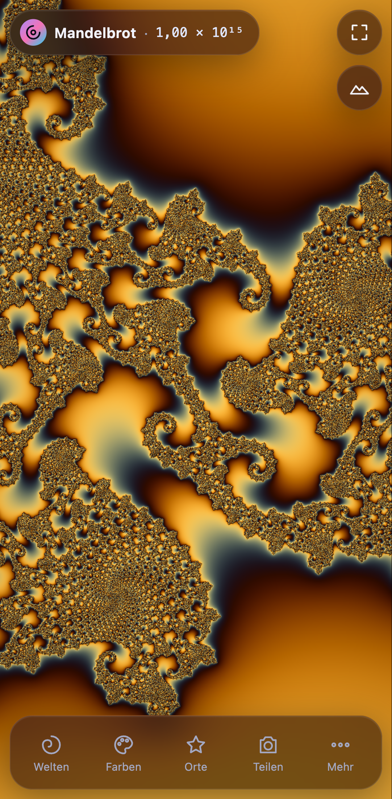

# 🌀 Fraktal-Explorer 6 – Deep Zoom fürs Handy, jetzt auch als 3D-Landschaft

**Live:** https://drpeterkalmar.github.io/Fraktale/ · installierbar als App (PWA), funktioniert offline.

Ein Mandelbrot- und Fraktal-Explorer, der auch auf einem Mittelklasse-Android-Handy flüssig bis in Tiefen von 10³⁰ (GPU) und 10²⁹⁰ (CPU) zoomt – ohne Kachel-Aufbau, ohne Flackern, mit mathematisch geprüften Bildern.

## 🖐 Gesten (Kurzanleitung)

| Geste | Wirkung |
|---|---|
| Ein Finger ziehen | verschieben – mit Schwung (Trägheit) |
| Zwei Finger spreizen/zusammenziehen | zoomen; der Punkt unter den Fingern bleibt stehen |
| Doppeltipp | hineinzoomen ×3 an dieser Stelle |
| Zwei-Finger-Tipp | herauszoomen ÷3 |
| Lange drücken (Mandelbrot) | Julia-Menge genau für diesen Punkt öffnen |
| Einmal tippen | Bedienelemente aus-/einblenden (Vollbild-Genuss); schließt offene Menüs |
| Unten: **Welten · Farben · Orte · Teilen · Mehr** | Bottom-Sheet mit allen Einstellungen (Griff ziehen: groß/zu) |

## 🏔 3D & Flug

Oben rechts **⛰ (3D-Landschaft)** antippen: die aktuelle Ansicht richtet sich als Gebirge auf – der Rand der Menge bildet die Kämme, die Menge selbst ist ein See, Farben = aktuelle Palette, Sonne mit weichen Schatten, Dunst zum Horizont. Die exakte Deep-Zoom-Rechnung bleibt dieselbe wie in 2D (die Landschaft liest nur das fertige Bild).

| Geste in 3D | Wirkung |
|---|---|
| Ein Finger ziehen | über die Landschaft schieben |
| Zwei Finger spreizen/zusammen | hinein-/herauszoomen |
| Zwei Finger drehen | Landschaft drehen |
| Zwei Finger gemeinsam hoch/runter | neigen (0–60°) |
| Doppeltipp / Zwei-Finger-Tipp | Zoom ×3 / ÷3 |
| Leiste unten: **✈ Flug**, ⛰ Höhe, 🧭 Ausrichten | Flug starten/stoppen, Bergehöhe, zurück auf Norden + Standardneigung |

**✈ Flug:** Die Kamera gleitet über die Landschaft und taucht dabei endlos in die Tiefe (Zoom + Vorwärtsflug); die Berge wirken in jeder Tiefe gleich hoch. Der **Zufallsflug** (✈ in der Leiste) steuert selbst zu interessanten Randbereichen (Kämme, Spiralen, Minibrots) und meidet das Schwarze und leere Ebenen. **✈ Flug** an einem gespeicherten Ort (Orte-Tab) startet im Gesamtbild und landet exakt dort. **Tippen = Pause**, **nach links/rechts wischen = lenken**, ⏩-Regler = Tempo. Bei Mandelbulb (schon 3D) und Buddhabrot gibt es keinen 3D-Schalter.
Desktop: rechte Maustaste ziehen = drehen/neigen, Shift+Pfeile = drehen/neigen, `D` = 3D an/aus, `V` = Flug.

**Desktop:** Mausrad = Zoom um den Mauszeiger, Ziehen = verschieben, Shift+Ziehen = Rechteck-Zoom.
Tasten: `M J B T 3 N` Modi · `P` Palette · `R` Reset · `S` Bild · `F` Vollbild · `I` Oberfläche · `H` Hilfe · `L` Sprache · `+/−` Iterationen · Pfeile verschieben · `Bild↑/↓` Zoom · `Z` Rechteck-Zoom.

Das HUD oben zeigt Modus und Tiefe (z. B. `1,23 × 10⁹`). Antippen öffnet Details: Koordinaten, Iterationen (−/+/Auto), Rechenweg, Renderzeit, FPS, Version. Antippen der Zoomzahl wechselt zwischen 10er-Potenz und Wörtern („1,23 Milliarden").

## ✨ Funktionen

- **8 Welten:** Mandelbrot, Julia (mit c-Pad: Punkt ziehen, Julia-Menge folgt live; Feinsteller ±0.1…10⁻⁴), Burning Ship, Tricorn, Mandelbrot z³, Newton, Mandelbulb 3D, Buddhabrot.
- **Farben:** 10 Paletten als echte Farbverlaufs-Vorschau + eigene Palette mit 6 Farbwählern (wird gespeichert), Farbdichte, Farbanimation (an/aus, Tempo), 3D-Relief, weiche Übergänge/Bänder, Funkeln im Inneren.
- **Orte:** eigene Orte merken (in jeder Welt, mit Mini-Bild), **▶ Tour** = automatischer Zoom-Flug vom Gesamtbild zum Ziel. Fest eingebaute Sehenswürdigkeiten gibt es seit 5.0.1 nicht mehr – sie lagen alle auf Mandelbrot-Koordinaten und passten in den anderen Welten nicht.
- **Teilen:** Bild (Web Share API bzw. Download, mit Beschriftung) oder Link zur exakten Stelle (Deeplink `#m=…&x=…&y=…&z=…`).
- **Mehr:** Iterationen (Auto oder manuell), Auflösung (Akku / Ausgewogen / Maximal), Rechenweg (Auto / GPU / CPU), exakte Nachrechnung, Tempo an Rechenleistung anpassen, Übersichtskarte, Rechteck-Zoom, Sprache (DE, EN + 7 weitere für die Hilfetexte), Vollbild, Reset, Hilfe, App installieren.

## 🧠 Wie es funktioniert (Architektur v5)

- **Hochpräzise Kamera** (`js/hp.js`): Bildmitte als BigInt-Festkommazahl (1088 Bit) statt decimal.js – keine externe Bibliothek mehr, offline-fähig.
- **Referenzorbit im Worker** (`js/orbit-worker.js`, `js/fractal-core.js`): BigInt-Iteration mit zoomabhängiger Präzision. Referenzwahl: Bildmitte, sonst **Minibrot-Kern** (Kugel-Periodenerkennung + Newton), sonst Gitter-Probe (längster Orbit). Für Julia zusätzlich der kritische Orbit (Rebase-Ziel). Nie auf dem Main-Thread.
- **GPU-Perturbation** (`js/shaders.js`): Delta-Iteration im Fragment-Shader (WebGL2, f32), Orbit als Float-Textur, pro Pixel eigener Orbit-Index, Zhuoran-Rebase, **BLA** (bilineare Approximation) zum Überspringen von Iterationen. Direkte f32-Iteration bis Zoom 1000 – gleiche Glättungsformel, daher nahtloser Übergang.
- **Exaktheit trotz f32:** Der finale Pass führt pro Pixel die Ableitung mit und schätzt den Rundungsfehler (vorhergesagter Iterationsfehler). Unsichere Pixel (typ. 1–25 %) rechnet der CPU-Worker-Pool in f64 exakt nach; die Korrektur wird per Crossfade übernommen. Danach ändert sich das Bild nicht mehr.
- **Iterationspuffer + Display-Pass** (`js/renderer.js`): Gerechnet wird in einen Iterationspuffer (R32UI); eingefärbt wird separat. Dadurch: Palette/Farbanimation/Relief ohne Neuberechnung, und bei Gesten wird das letzte Bild **reprojiziert** (60 fps), während im Hintergrund eine niedrig aufgelöste Vorschau nachläuft. Im Stillstand: Verfeinerung bis volle Auflösung, Tausch per Crossfade. Rechenarbeit in Fence-getakteten Häppchen – kein GPU-Stau, keine Main-Thread-Blockade.
- **Nahtloser Bildaufbau (5.1)**: Jedes fertige Bild bleibt als **Ebene** erhalten (bis 8). Der Display-Pass trägt sie nach Schärfe sortiert auf (Pufferpixel pro Bildschirmpixel nach Reprojektion): eine gröbere neue Vorschau füllt nur Lücken und überdeckt nie ein schärferes altes Bild; neue Ebenen blenden zeitbasiert ein (150 ms in Bewegung, 220 ms im Stillstand), Ränder sind gefedert, vergrößerte Vorschauen werden auf dem Iterationswert interpoliert (Catmull-Rom) statt auf Farben. In Bewegung wird für die **vorausgesagte** Kamera gerechnet, und nur der Teil, der noch nicht scharf genug ist (beim Schwenk ein Streifen am vorderen Rand in hoher Auflösung). Im Leerlauf wird **vorausgerechnet** (tieferer Referenzorbit, weite Reserve-Ebenen, Ring, Mitte ×2). Animierte Bewegungen (Tour, Doppeltipp, Rad, Schwung) bremsen weich, bevor das Bild grob würde; Finger-Gesten bleiben 1:1. A/B-Regler: `?blend=0` (Verhalten 5.0.1), `?maxdiv=`, `?over=`, `?fadems=`, `?feather=`, `?recon=0`, `?predict=0`, `?prefetch=0`, `?strips=0`, `?gov=0`. Details: `V51_BERICHT.md`.
- **3D-Landschaft (6.0)** (`js/three.js`): liest nur die fertigen Iterationspuffer-Ebenen. Pro Ebene eine Höhentextur (halbe Auflösung, RG16F, Mipmaps), Gitter im Bildraum mit Vertex-Texture-Fetch, Höhe = log₂(1+μ) histogramm-entzerrt (Quantile aus einer kleinen Sonde), Menge = See, weiche Schatten pro Gitterpunkt, Licht/Farbe pro Pixel, Dunst + Himmel, Fels auf Steilflächen. In 3D rechnet die App quadratisch (Drehen) und zusätzlich ferne Detailstufen für den Horizont; die Sonde steuert auch den Zufallsflug.
- **CPU-Pfad** (`js/tile-worker.js`): gleicher Algorithmus in f64 für Zoom > 10³⁰, Newton-Tiefzoom, als Fallback (Rechenweg „CPU") und für die exakte Nachrechnung. Worker-Zahl = Kerne − 1.
- **PWA** (`manifest.webmanifest`, `sw.js`): versionierter Cache (`fraktale-<Version>`), jede Datei mit `?v=<Version>`, HTML network-first. Worker-URLs hängen automatisch an `APP_VERSION`.

## ✅ Prüfung (Zahlen sind der Beweis)

Unabhängige Wahrheit: direkte Iteration in Python-`Decimal` (`tests/truth.py`) an 400 Stichprobenpixeln je Ansicht, Kriterium |Δμ| ≤ 1 Iteration bei ≥ 99 %.

| Ansicht | GPU (Metal) | CPU f64 |
|---|---|---|
| Seepferdchen 10⁷ | 100 % | 100 % |
| Randpunkt 10⁹ | 99,5 % | 99,5 % |
| Peters Spirale 1,7·10⁷ | 100 % | 100 % |
| Seepferdchen 10¹⁴ | 99,5 % | 99,5 % |
| Randpunkt 10¹⁵ | 99,75 % | 99,75 % |
| Julia 10¹⁰, Tricorn 10⁶, Burning Ship 10⁶, z³ 10⁵ | 99,5–100 % | – |
| Übergang direkt↔Perturbation (Zoom 999/1001) | 100 % / 100 % | 100 % |
| Randpunkt 10⁴¹ (nur CPU) | – | 99,75 % |

Details, Methode und Grenzfälle: `V5_BERICHT.md`. Tests laufen lokal mit `python3 -m http.server 8472` und `python3 tests/<test>.py`.

## 🛠️ Start ohne Internet

Ordner herunterladen, `start_fractal.bat` (Windows) doppelklicken oder `python3 -m http.server 8000` und http://localhost:8000 öffnen. Kein Build-Schritt nötig.

## 📜 Änderungen

**Version 6.0.0** – 3D-Landschaft + Flug
- Neu: **🏔 3D-Landschaft** (Schalter oben rechts, alle Welten außer Mandelbulb/Buddhabrot): Höhe aus der geglätteten Iterationszahl mit Histogramm-Entzerrung (Relief auch in dichten Tiefen), Menge = See, Rand = Kämme; Neigen, Drehen, Höhenregler; Sonne mit weichen Schatten, Dunst, Himmel; weicher Übergang 2D ↔ 3D (bei Neigung 0 identisch zum 2D-Bild).
- Neu: **✈ Flug** – Zufallsflug entlang interessanter Randbereiche oder Flug zu einem gespeicherten Ort (exakte Ankunft); Tippen = Pause, Wischen = lenken, Tempo-Regler; die Tempo-Bremse aus 5.1 gilt auch hier.
- Technik: Gitter im Bildraum mit Vertex-Texture-Fetch (WebGL2) über Mipmap-Höhentexturen pro Bild-Ebene, ferne Detailstufen für den Horizont, Renderauflösung passt sich der Bildrate an. 2D-Pfad unverändert (Display-Shader bytegleich, 2D-Bild nach 3D an/aus pixelgleich, Wahrheitstests unverändert). Details: `V6_BERICHT.md`.
- Verbessert (2D): dritte, winzige Reserve-Ebene (1/256 Zoom) – schnelles Herauszoomen bis ×256 ohne schwarze Ränder (Test ×100 in 2 s: 0 % Lücken, 5.0.1: ~90 %).
- Hinweis PWA: App einmal ganz schließen und neu öffnen, dann steht unter „Mehr" 6.0.0.

**Version 5.1.0** – nahtloser Bildaufbau
- Neu: Bilder bauen sich weich auf und gehen nahtlos ineinander über – kein Rückfall auf ein gröberes Bild, kein Aufblitzen, keine harten Wechsel mehr (5.0.1 tauschte während Bewegung hart und ersetzte das scharfe alte Bild durch jede grobe Vorschau).
- Neu: Ebenen-Stapel mit schärfe-bewusstem Compositing, gefederten Rändern, zeitbasiertem Einblenden auch in Bewegung; Vorschau-Rekonstruktion auf dem Iterationswert (weniger pixelig); gröbste Vorschau 1/6 statt 1/12.
- Neu: Vorschau für die vorausgesagte Kamera; beim Schwenk wird nur der neue Rand gerechnet (dafür in höherer Auflösung); bekanntes Ziel (Doppeltipp, Tour-Ende, auslaufender Schwung) wird direkt gerechnet.
- Neu: Vorausrechnen im Leerlauf (tieferer Referenzorbit, Reserve-Ebenen gegen schwarze Ränder beim Herauszoomen, Ring für Schwenks, Bildmitte ×2) – niedrigste Priorität, nicht bei „Akku", nicht im Hintergrund.
- Neu: „Tempo an Rechenleistung anpassen" (Mehr, Standard an): Tour/Doppeltipp/Rad/Schwung werden kurz langsamer, wenn das Bild sonst grob würde; Finger-Gesten bleiben 1:1.
- Fix: Bildraten-Schätzung (einzelne kurze Frames drückten sie auf ~8 ms, die Vorschau-Arbeit schrumpfte dann auf 1024 Pixel pro Frame).
- Gemessen (M1, Pixel-7-Ansicht, 5.0.1 → 5.1.0, Anteil Frames mit grobem Bild): Pinch 10³→10⁹ 89 % → 3 %, Schwenk 91 % → 18 % (Lücken 85 % → 0 %), Tour bis 10¹² 77 % → 3 % (Dauer 14,2 → 15,0 s), Doppeltipp-Serie 51 % → 6 %; harte Wechsel 35 → 0. Exaktheit (Wahrheitstests) unverändert.
- Hinweis PWA: App einmal ganz schließen und neu öffnen, dann steht unter „Mehr" 5.1.0.

**Version 5.0.1**
- Entfernt: fest eingebaute Sehenswürdigkeiten (12 Orte + Vorschaubilder). Sie lagen alle auf Mandelbrot-Koordinaten und zeigten in Julia, Burning Ship, Tricorn, z³ usw. etwas Beliebiges. Der Orte-Tab enthält jetzt nur mehr eigene Orte – die funktionieren in jeder Welt (inkl. Julia-Parameter, auch bei ▶ Tour).

**Version 5.0.0** (Android-first-Neubau)
- Neu: GPU-Perturbation mit BLA statt CPU-Kacheln ab 10⁵ – Deep Zoom bis 10³⁰ auf der GPU, CPU-f64 bis 10²⁹⁰.
- Neu: exakte Nachrechnung unsicherer Pixel (f32-Fehlerschätzung + CPU-f64); geprüft gegen Decimal-Wahrheit.
- Neu: Referenzorbit per BigInt im Worker (vorher decimal.js auf dem Main-Thread: bis 236 ms Blockaden), Referenzwahl über Minibrot-Kerne.
- Neu: Reprojektion alter Bilder während Gesten, Vorschau→Verfeinerung mit Crossfade, kein Kachel-Aufbau, kein Flackern.
- Neu: Oberfläche komplett neu: HUD-Pille, Dock in der Daumenzone, Bottom-Sheet (Querformat: Seitenpanel), Glas-Design, Touch-Ziele ≥ 48 px, `dvh` + Safe-Areas, `touch-action` gegen Browser-Doppeltipp-Zoom.
- Neu: Gesten mit Trägheit, Doppeltipp, Zwei-Finger-Tipp, Langdruck → Julia.
- Neu: Orte als Karten mit Vorschaubildern, eigene Orte, Auto-Zoom-Tour, Teilen (Web Share), Deeplinks, Vollbild, PWA/offline.
- Neu: 4 zusätzliche Paletten, Farbdichte, Relief, Farbanimation abschaltbar (spart Akku: ohne Animation zeichnet die App im Stillstand nichts neu).
- Fix: Buddhabrot war fast schwarz (z₀ = 0 wurde von jedem Orbit gezählt und dominierte die Normierung).
- Messwerte (M1, Pixel-7-Viewport, 4 Kerne, Zeit bis exaktes Endbild): 10⁷ 4,8 → 1,5 s · 10⁹ 3,0 → 1,3 s · 10¹⁴ 17,7 → 4,6 s; erstes Bild nach < 0,1 s; Main-Thread-Long-Tasks: bis 236 ms → 0.

**Bewusst ersetzt/entfernt (v5):**
- *Formel-Leiste unten* → die Formeln stehen auf den Welten-Karten; im Julia-Modus zeigt ein Chip über dem Dock das aktuelle c (Tipp öffnet c-Pad und Feinsteller). Grund: Platz in der Daumenzone.
- *Ziffern-Stepper für Julia-c* → Feinsteller mit wählbarer Schrittweite (0.1 … 10⁻⁴) plus c-Pad; gleiche Funktion, größere Touch-Ziele.
- *Pfeiltasten ↑/↓ = Iterationen* → Pfeiltasten verschieben jetzt (wie die Hilfe schon immer behauptete); Iterationen per `+/−`.
- *Info-Panel links oben, Palettenliste rechts oben, Bookmark-Leiste unten* → HUD-Pille + Bottom-Sheet (alles weiter vorhanden).
- *Übersichtskarte* ist am Handy standardmäßig aus (Platz), ab 900 px Breite an; Schalter unter „Mehr".
- *Google-Fonts und decimal.js vom CDN* → Systemschrift und eigene BigInt-Arithmetik (offline, keine Drittanbieter-Anfragen).
- *„Shift+Klick = Julia" (stand im alten README, war nicht umgesetzt)* → Langdruck (Maus: gedrückt halten).
- Aufgeräumt: `*_recovered.js`, `alpha_diff.patch`, alte `test_*.py` und `shots_*/` (v4-spezifisch); neue Tests in `tests/`.

**Version 4.8.0**
- Neu: **Custom-Palette** (7. Eintrag im Palette-Picker) mit 6 Color-Pickern — live-Vorschau beim Ziehen, automatisches Speichern (localStorage), bleibt über Reloads erhalten. Wirkt überall: GPU-Shader, CPU-Worker, Minimap, Buddhabrot.
- Klarstellung: CPU-Modus übernimmt bereits ab **100.000×** (`ZOOM_THRESHOLD = 1e5`) — Kommentar im Code auf den tatsächlichen Stand korrigiert (war ein df64-Überbleibsel von ~1e11).
- Hotfix (993b1f6): `saveCustomPalette`/`loadCustomPalette` waren im ersten 4.8.0-Push undefiniert → `init()`-Crash (Panel hing beim Fallback-Tag). Lehre: `node --check` findet fehlende Funktionsdefinitionen nicht — E2E vor „live"-Ausruf. Statischer No-JS-Fallback-Tag auf 4.8.0 aktualisiert.

**Version 4.7.4**
- Default-Iterationen 500 → 300: flüssigeres Standard-View, Details bei Bedarf manuell per +/− erhöhen.
- Adaptiver Iterations-Floor startet jetzt BEI 300 (statt Basis 1000 + 1000 drauf): exakt 300 bis Zoom ~280, danach wächst er quadratisch mit log₁₀(zoom) weiter. Gilt einheitlich an allen drei Stellen (CPU-Render, Referenz-Orbit, GPU-Render); manuelle Werte bleiben unangetastet.
- Cache: `fraktal.js?v=1.16` (Safari-Cache-Lehre — Query bumpen, wenn sich fraktal.js ändert).

**Version 4.7.3**
- Kosmetik: Panel-Modusanzeige „GPU f64" heißt jetzt nur mehr „GPU" (das f64-Detail gehört in Changelogs, nicht ins HUD).

**Version 4.7.2**
- Fix: Panel-Versions-Tag wurde bei jedem UI-Update von `updateUI()` mit hardcodierter '4.5' überschrieben (Überbleibsel vom v4.5-Hotfix) — `index.html`-Bumps waren dadurch unsichtbar. Jetzt: `APP_VERSION` in `fraktal.js` als Single Source of Truth, Panel liest nur mehr die. Release-Checkliste erweitert.

**Version 4.7.1**
- Fix: GPU-Zoom ruckelte/pixelt seit v4.7 — der v4.6-Beschleunigungs-Lerp sprang 19 % pro Frame auch bei kleinsten Gesten (Spielfluss!). Jetzt Bremsprofil: kleine Gesten gleiten exakt wie originally, große Deep-Zoom-Sprünge beschleunigen den Renderstart trotzdem 4-18×.
- Klarstellung: shaders.js (GPU) war und ist unverändert — das Ruckeln kam vom Kamera-Lerp, nicht von der GPU-Mathe.

**Version 4.7**
- Neu: CPU-Renderer nutzt bis Zoom 1 Billionen direkte f64-Berechnung (wie Mandelbrot z³/Newton — Peters Vorschlag!) und erst darunter Perturbation. Bis 1e12 exakt & artefaktfrei.
- Fix: Formel-Leiste auf dem iPhone war im Weg (CSS-Kaskaden-Bug: Mobile-Regel stand vor der Basis-Regel und verlor).
- Fix: Worker-Cache-Busting — Safari hatte alte Worker-Versionen wochenlang gecacht (deshalb zeigte Peters iPhone noch v4.5 mit alten Artefakten).
- Fix: Iterations-Buttons (+/−) reagieren im CPU-Modus wieder — vor dem Fix hat der adaptive Iterations-Floor jeden manuellen Wert sofort zurückgesetzt und kein Re-Render wurde getriggert. Manuelle Werte bleiben jetzt stabil, Bookmark-Klick kehrt zur adaptiven Iterationswahl zurück.
- Fix: CPU-Modus war bei Deep-Zooms zu weich/verwaschen — die Perturbations-Mathe wertete Flucht/Rebase am falschen Orbit-Index aus (globaler Iterationszähler statt Orbit-Position pro Pixel). Jetzt: Fluchttest am vollen z, Zhuoran-Rebasing mit Orbit-Neustart. Beweis: Pixel-Test gegen direkte f64-Wahrheit (max. Abweichung 0,56 Iterationen).
- Speed: Rendern startet deutlich früher nach dem Zoomen — zweistufige Annäherung (Zeitkappung: jede Geste schafft den Renderstart in ~1 s, kleine Zuschritte gleiten weich weiter).
- Speed: Render-Startschwelle früher (Rest-Bewegung < 2 % statt < 0,5 %).

**Version 4.5**
- Fix: CPU-Modus zeigt jetzt KEINE Farbartefakte mehr beim Zoomen und Scrollen (Kacheln werden korrekt ins sichtbare Bild gemalt, alte Render-Reste werden vor jedem Durchgang geräumt).
- Fix: Flächige Orange/Weiße Bilder beim Verschieben im Deep-Zoom behoben (weicher Bildpuffer bleibt beim Verschieben liegen, GPU-Precision-Müll blitzt nicht mehr durch).
- Neu: Zhuoran-Rebasing in der Perturbations-Mathe — beseitigt Präzisions-Knicke bei sehr tiefen Zooms und macht kurze Referenz-Orbits harmlos.
- Neu: Laufzeit-Iterationen passen sich jetzt schon im GPU-Bereich der Zoom-Tiefe an (keine „flachen" Regionen mehr bei mittleren Zoomstufen).
- Fix: Farbsprünge zwischen rendern Kacheln (Farbzyklus wird pro Rendervorgang eingefroren).
- Fix: Sanfte Farbverläufe in allen Fraktal-Modi (kein Banding mehr in Burning Ship / Tricorn / z³).

**Version 4.4**
- Fix: CPU-Rendering-Verschiebung (kein verschobenes Bild mehr beim Zoomen).
- Fix: Präzisionsprobleme bei sehr tiefem Zoom.
- Fix: Interaktion friert beim Rendern nicht mehr ein.

---
*Entwickelt mit ❤️ für kleine und große Entdecker.*
