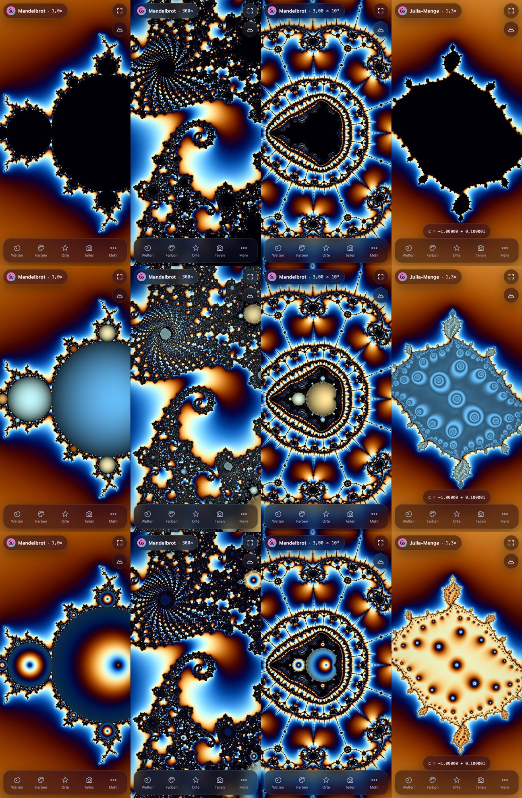
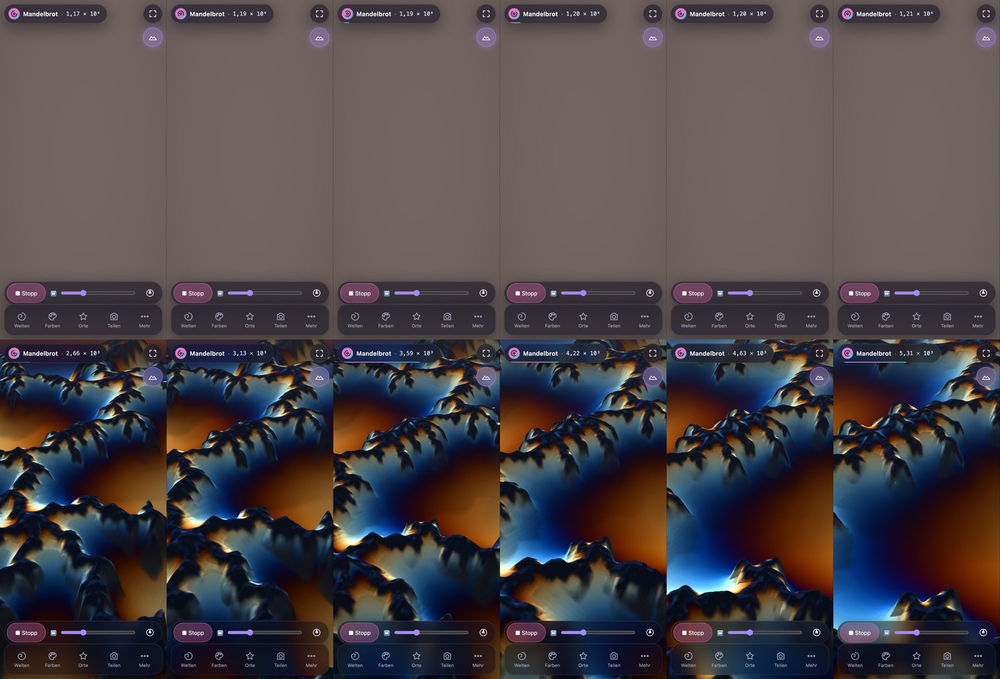

# Fraktal-Explorer 6.3 + 6.4 – Bericht „3D-Start ohne Hänger“, „Bunte Menge“, „Flug bleibt am Mengenrand“

Datum 05.10.2026. Auftrag: Peters Wunsch vom 04.10. (22:40): „Der Start vom 3D-Modus hängt Chrome am rog für
30 Sekunden auf – vielleicht geht das ressourcenschonender am Start?“ (rog = Windows 11, Chrome, RTX 3070 Ti → WebGL
läuft dort über ANGLE/Direct3D 11 mit dem FXC-Shader-Compiler). Vorgaben: Look nicht ändern, 2D nach 3D an/aus
pixelgleich, Wahrheitstests unverändert.

**Bitte am rog in Chrome testen: ⛰ antippen.** Erwartung: Der Tab friert nicht mehr ein. Der ⛰-Knopf bekommt einen
dezenten Ring („3D wird vorbereitet …“), das 2D-Bild bleibt verschiebbar und zoombar, danach richtet sich die
Landschaft auf. Wenn die Vorbereitung dort noch spürbar lange dauert, bitte die Messung unten laufen lassen.
(PWA: App einmal ganz schließen und neu öffnen bzw. Seite neu laden, unter „Mehr“ steht dann 6.3.0.)

## 1. Kurzfassung

- **Ursache (im Code bestätigt, am Mac nachgemessen):** Beim Antippen von ⛰ wurden alle sieben 3D-Programme übersetzt,
  darunter drei Gelände-Varianten (Standard/Weiß/Alpin), obwohl nur eine gebraucht wird. Das erste 3D-Bild fragte dann
  `LINK_STATUS` ab, und diese Abfrage **wartet**, bis der Treiber fertig ist. Bis dahin stand der ganze Tab. Der
  Gelände-Shader war zudem sehr groß: Jede der 6 Ebenen stand als eigene Kopie im Code, in `colorAt` sogar 6 × 6, und
  jede Aufrufstelle wurde komplett eingebettet. Genau solche entrollten Kopien braucht FXC unter Windows sekunden- bis
  minutenlang (bekanntes Shadertoy-Problem).
- **Jetzt wartet die App nie mehr auf den Treiber.** Der Übersetzungsstand wird einmal pro Bild abgefragt
  (`COMPLETION_STATUS_KHR`, blockiert nicht). Ohne diese Erweiterung wird in Häppchen über mehrere Bilder übersetzt.
  3D blendet erst ein, wenn alles fertig ist; bis dahin bleibt 2D bedienbar.
- **Nur die gebrauchte Gelände-Variante** wird übersetzt. Ein Look-Wechsel in 3D (z. B. Alpin) übersetzt im
  Hintergrund, der alte Look bleibt solange stehen.
- **Gelände-Shader kleiner, gleiches Bild, schneller:** Ebenen als echte Schleifen, Höhenabfragen gebündelt. Im
  Pixelvergleich gegen 6.2.0 auf identischen Daten (112 Fälle) weichen ≥ 99,995 % der Pixel höchstens 1/255 ab. Ein
  3D-Bild braucht auf dem M1 jetzt 15 % weniger Zeit (Standard), mit Alpin-Look 35 % weniger.
- **Messung (M1, Shader jeweils frisch übersetzt):** 6.2.0 friert beim Antippen **1,35 s** ein (Alpin 1,4 s), 6.3.0
  hat **0 Long Tasks**. Mit einem simulierten langsamen Treiber (jedes Programm 8 s bzw. 30 s Übersetzung, wie FXC am rog)
  stand 6.2.0 die ganzen 8 s still. 6.3.0 läuft dabei mit **60 fps** weiter, und 3D erscheint, sobald der Treiber fertig
  ist.

## 2. Umsetzung

### 2.1 Nie blockieren (`js/renderer.js`, `js/app.js`)
- `R.programReady(key, fs, vs)` startet die Übersetzung bei Bedarf und fragt danach nur noch
  `COMPLETION_STATUS_KHR` (wartet nie). Erst wenn diese Abfrage „fertig“ meldet, wird `LINK_STATUS` gelesen, und das
  kostet dann nichts mehr.
- Ohne `KHR_parallel_shader_compile` (manche Treiber): Vertex-Shader, Fragment-Shader und Link laufen je in einem
  eigenen Bild, höchstens ein Programm pro Bild. Kein einzelnes Bild trägt die ganze Übersetzung.
- `set3d(true)` schaltet nur ein, wenn `T3.ready(look)` (alle Programme des Looks übersetzt) und `T3.warm(look)`
  (angewärmt, siehe 2.4) erfüllt sind. Sonst merkt sich die App den Wunsch (`V3.prep`) und prüft ihn in jedem Bild
  erneut. Die Rechnung bleibt bis dahin 2D. ✈ während der Vorbereitung startet den Flug, sobald 3D bereit ist.
- Oberfläche: Der ⛰-Knopf zeigt einen sich drehenden Ring mit Füllstand, Titel und `aria-label` lauten „3D wird
  vorbereitet …“. Dauert die Vorbereitung länger als 0,4 s, erscheint dieselbe Meldung kurz als Toast. Nochmal tippen
  bricht ab (DE/EN, die übrigen Sprachen fallen auf EN zurück).

### 2.2 Nur übersetzen, was gebraucht wird (`js/three.js`)
- `needs(look)` = Höhen-Aufbau, Himmel, **eine** Gelände-Variante, Kopieren, Sonde, bei Weiß/Alpin dazu das Rauschen.
  Das sind 5–6 statt 7–8 Programme, und es wird nur eines der großen Gelände-Programme übersetzt statt drei.
- Look-Wechsel in 3D: `terrainProgram()` zeichnet mit der bisherigen Variante weiter (`T3.waiting`, die App zeichnet
  weiter), bis die neue übersetzt und angewärmt ist. Test: Wechsel auf Alpin bei 2,5 s simulierter Übersetzung. Erst
  bleibt der Standard-Look stehen, dann erscheint Alpin; längste Bildlücke 34 ms, keine Long Tasks.

### 2.3 Shader kleiner, Look gleich
- **Ebenen-Schleifen** `for (i < u_n3)` mit einem Uniform als Obergrenze; das verhindert, dass der Compiler entrollt
  (derselbe Kniff wie das `min(0, iFrame)` auf Shadertoy gegen lange Windows-Übersetzungen). GLSL ES 3.0 erlaubt bei
  Sampler-Arrays nur konstante Indizes, darum wird die Ebene per `switch` gewählt. Die Rechnung selbst steht jetzt einmal
  im Code statt sechsmal.
- `colorAt`: Die verschachtelte `below`-Kette (6 × 6) ist jetzt der Index der letzten deckenden Ebene.
- **Aufrufstellen gebündelt:** Der Vertex-Shader hatte 7 eingebettete Höhen-/Ufer-Abfragen plus 6 entrollte
  Schattenschritte (78 eingebettete Ebenen-Abfragen). Jetzt sind es 3 Schleifen mit je einer Aufrufstelle. Der
  Fragment-Shader hatte 3 Höhenabfragen und 6 Farbebenen, dazu eine Messhilfe, die `colorAt` zweimal zusätzlich
  einbettete. Jetzt sind es je eine Aufrufstelle; die Messhilfe zählt den See-Anteil mit.
- **Pixelvergleich** (`tests/compare_3d_shader.py`): In derselben Seite zeichnet eine zweite 3D-Instanz mit dem
  `three.js` von 6.2.0 auf exakt denselben Daten. Abgedeckt sind 4 Ansichten (Gesamtbild, Seepferdchen 300×,
  Randpunkt 10⁹, Julia), 6 Looks (Standard, ohne „Menge glatt“, Weiß, Dunkel, Alpin Wald/See), 45° und 60° Neigung,
  hoch und quer sowie der 8-Bit-Ersatzpfad. Ergebnis: **112/112 Fälle, ≥ 99,995 % der Pixel weichen höchstens 1/255
  ab**, einzelne Pixel bis 21–213 (Rundung an Kanten). Gegenprobe neu gegen neu: 100 % identisch. Auch mit
  hochskaliertem Bewegungsbild (65 %): ≥ 99,998 %.
- **Bildzeit** (gleiche Szene, Wanduhr, Minimum, M1, 65 % Auflösung, Mittel über die Ansichten):

| 3D-Bild | 6.2.0 | 6.3.0 |
|---|---|---|
| Standard | 3,37 ms | **2,86 ms** (−15 %) |
| ohne „Menge glatt“ | 3,27 ms | **2,80 ms** |
| Weiß (Gletscher) | 3,65 ms | **3,04 ms** |
| Alpin Wald / See | 5,77 / 5,68 ms | **3,72 / 3,66 ms** (−35 %) |

  Die Größe des vom Treiber übersetzten Codes (Metal) sinkt dabei kaum: 90,4k → 85,6k Zeichen, Alpin 104,9k → 100,0k.
  Metal bettet Funktionen nicht ein. Entscheidend ist die Einbettung bei FXC (Direct3D), und genau die messen die
  Windows-Läufe unten (`translatedChars` = HLSL-Länge, `compileMs` = FXC-Zeit je Programm).

### 2.4 Anwärmen (am Mac gefunden)
- Auch nach „fertig übersetzt“ stand das erste 3D-Bild am Mac noch ~190 ms (GPU-Prozess; der Haupt-Thread war frei).
  Ursache: Der Treiber baut beim ersten Zeichnen die Pipeline. Darum zeichnet die App vor dem Einblenden jedes Programm
  einmal unsichtbar in ein winziges Ziel mit denselben Formaten, **je Bild nur eines** (`T3.warm`; A/B: `?nowarm`).
- **Rest (nur Mac, nur einmal):** Ist der Metal-Shadercache leer, also nach einem App-Update mit geänderten Shadern
  oder beim allerersten Start, bleibt eine einzelne Anzeige-Pause von ~170 ms. Der Haupt-Thread ist dabei frei
  (0 Long Tasks). Sie entsteht, wenn der kleine Kopier-Shader zum ersten Mal auf den Canvas zeichnet: Metal übersetzt
  dafür eine eigene Variante (Canvas ohne Alphakanal). Mit gefülltem Cache (jeder weitere Start) gibt es keine Pause
  über 30 ms, 3D steht nach ~100 ms. Das Ziel „kein Bild > 100 ms“ ist am Mac damit nur fast erreicht.
- **Korrektur in 6.4.0:** 6.3.0 gab das Bild per `blitFramebuffer` an den Canvas (Pause dann nur ~130 ms). Das hat
  sich als unzuverlässig erwiesen. Die Kopie des 2D-Bilds für die Überblendung (`copyTexSubImage2D` aus dem Canvas
  ohne Alphakanal in ein RGBA-Ziel) ist unzulässig, darum blendete 3D beim Einschalten ≈0,2 s über Schwarz statt über
  das 2D-Bild ein. Außerdem räumt ANGLE/Metal den frisch getauschten Canvas-Puffer nach einem Blit teils nachträglich
  leer (im Test: leere Auslesung in ~1/3 der Läufe). 6.4.0 nutzt wieder den Kopier-Shader wie bis 6.2.

## 3. Messung

Skript `tests/measure_3d_start.py` (Mac und Windows): Es startet selbst einen Webserver und einen Browser mit frischem
Profil, tippt ⛰ an und hängt sich versionsunabhängig in WebGL ein (funktioniert auch mit 6.2.0). Gemessen werden:
Zeit bis zum ersten 3D-Bild, Bildlücken (`requestAnimationFrame`), Long Tasks, Bildrate während der Vorbereitung,
Wartezeit in Statusabfragen, je Programm Übersetzungszeit und übersetzte Codegröße. Jeder nach dem Antippen übersetzte
Shader wird per Nonce einmalig gemacht (sonst misst man ab dem 2. Lauf nur Caches); `--cache` schaltet das ab.
`--slow=MS` simuliert einen langsamen Treiber. Rohdaten: `tests/results_3dstart_*.json`.

Mac mini M1, Chrome for Testing (ANGLE/Metal), Desktop-Ansicht 1280×800, Seepferdchen-Tal 300×, je 2–3 Läufe:

| | 6.2.0 | **6.3.0** |
|---|---|---|
| Längster Haupt-Thread-Block (Long Task) | 1 348–1 368 ms | **keiner** |
| Längste Bildlücke | 1 349–1 353 ms | **126–140 ms** (6.3.0; 6.4.0: 167–180 ms, siehe 2.4) |
| Warten in Shader-Statusabfragen | 1 344 ms | **0,1 ms** |
| Tippen → erstes 3D-Bild | 398–406 ms | 397–398 ms |
| Bildrate während der Vorbereitung | – (eingefroren) | **63 fps** |
| Alpin-Look: Block / Lücke | 1 424–1 440 ms / 1 406–1 423 ms | **keiner / 141 ms** |
| mit Shadercache (2. Start): Lücke, Tippen → 3D | 29–33 ms, 37–43 ms | 25–28 ms, 98–100 ms |
| **simuliert 8 s Übersetzung je Programm** | **7 990 ms eingefroren** | 0 Long Tasks, Lücke 141 ms, **60 fps**, 3D nach 8,4 s |
| **simuliert 30 s** | (nicht gemessen; wie bei 8 s eingefroren) | 0 Long Tasks, Lücke 125 ms, **60 fps**, 3D nach 30,4 s |

Mit Shadercache braucht 6.3.0 bis zum 3D-Bild ~60 ms länger als 6.2.0. Das sind die 6–8 Anwärm-Bilder (je ein
Programm pro Bild); dafür gibt es keinen Ruckler.

- **SwiftShader** (`--angle=swiftshader`, wie im Auftrag als „langsamer Treiber“ vorgeschlagen) taugt hier nicht als
  Ersatz: Ihm fehlt `KHR_parallel_shader_compile`, er übersetzt erst beim Zeichnen, und jede Abfrage wartet auf die
  2D-Rechnung, die dort auf der CPU läuft (2–3 s je Abfrage, unabhängig vom Shader). Einmal gemessen: 6.2.0 6,3 s Long
  Task. Wegen der Last auf dem 8-GB-Mac habe ich die Messung danach nicht weiter verwendet; stattdessen
  simuliert `--slow` den langsamen Treiber gezielt.

**Messung am rog (Windows, Chrome, Direct3D 11)** – im Projektordner (Python 3.12, `py -m pip install playwright`):

```
py tests\measure_3d_start.py --tag=rog_v630 --runs=3
py tests\measure_3d_start.py --tag=rog_v630_live --url=https://drpeterkalmar.github.io/Fraktale/
:: Vergleich 6.2.0:  git worktree add ..\Fraktale_v620 933214a
py tests\measure_3d_start.py --tag=rog_v620 --root=..\Fraktale_v620 --runs=2
```
Das Skript nimmt das installierte Chrome (Standard-Backend, also Direct3D 11) und schreibt
`tests\results_3dstart_rog_*.json` plus eine Textzeile je Lauf. Spannend dort: `compileMs` des Programms `gelaende_0`
(FXC-Zeit) und `translatedChars` (HLSL-Länge) 6.2.0 gegen 6.3.0 sowie `maxFrameGapMs`/`longTasks` (Ziel: < 100 ms, 0).

## 4. Tests
- `tests/run_all.sh` komplett grün: Node-Kern, Release/PWA/offline (Cache `fraktale-6.3.0`), Wahrheit GPU + CPU
  (okPct/maxDiff unverändert), Gesten, UI, Funktionen, Bildaufbau, 3D (inkl. **2D nach 3D an/aus pixelgleich:
  1,0000 wie zweimal 2D**), Glättung 6.1, 6.2. Beim Zufallsflug-Wischtest in `test_v62` gab es einmal einen
  Timing-Ausreißer (+0,20 statt > 0,25 rad); der Wiederholungslauf ergab +0,80 rad, PASS.
- Neu **`tests/test_v63.py`** (in `run_all`), langsamer Treiber simuliert (2,5 s je Programm):
  „3D wird vorbereitet …“ sichtbar; 2D lässt sich währenddessen verschieben; 3D erscheint von selbst nach 2,5 s;
  längste Bildlücke 28 ms, keine Long Tasks; nur Gelände-Variante 0 übersetzt; Look-Wechsel auf Alpin ohne Block (erst
  alter Look, dann Alpin); zweites Antippen bricht ab; ✈ während der Vorbereitung startet danach den Flug; ohne
  `KHR_parallel_shader_compile` erscheint 3D nach 0,5 s; 3D an/aus 5× zuverlässig; 0 Fehler.
- Neu `tests/compare_3d_shader.py` (Pixelvergleich + Bildzeit gegen 6.2.0), `tests/measure_3d_start.py` (Messung).

## 5. Grenzen / offen
- **Am rog nicht gemessen** (Auftrag: den rog nicht selbst ansteuern). Wie lange FXC für den neuen Gelände-Shader
  braucht, zeigt erst die Messung dort. Hängen kann der Tab nicht mehr, im schlimmsten Fall dauert nur die Vorbereitung
  (mit Ring am Knopf) länger. Sollte sie dort noch viele Sekunden dauern, wäre der nächste Schritt der gestaffelte Start
  (Auftrag Punkt 4: erst eine schlanke Variante, die volle im Hintergrund).
- Leerlauf-Vorübersetzen (Punkt 5) bewusst nicht wieder aufgenommen: Mit nicht blockierendem Abfragen wäre es zwar
  möglich, aber die 6.0-Messung (2D-Rechnung wartet in der Treiber-Warteschlange) gilt weiter, und der Start ist auch so
  nicht mehr blockierend.
- Mac: einmalige Anzeige-Pause von ~170 ms nach Updates (siehe 2.4).

---

# 6.4.0 Bunte Menge

Peters Wunsch vom 04.10. (22:55): „Menge auch mehrfärbig machen“. **Einschalten:** unten **Farben** → Abschnitt
**Farbe der Menge** → **Bunt** (sechster Knopf, Farbpunkt mit Palettenverlauf); darunter **Inseln** oder **Ringe**.
Standard bleibt Schwarz – das bisherige Bild ändert sich nicht ungefragt. Gespeichert und im Link: `sc=b1` (Inseln),
`sc=b2` (Ringe).



## 1. Was man sieht
- **Inseln** (Standard bei Bunt): Jede Knospe und jedes Mini-Mandelbrot bekommt eine eigene Farbe der aktuellen Palette
  (Periode des anziehenden Zyklus → Palettenfarbe; aufeinanderfolgende Perioden liegen über den Goldenen Schnitt weit
  auseinander, sehr dunkle Palettenstellen werden durch die gegenüberliegende ersetzt). Zur Knospenmitte wird es heller,
  zum Rand dunkler – das wirkt wie angeleuchtete Kuppeln. Hauptkardioide blau, Periode-2-Kreis türkis, Periode-3-Knospen
  sandfarben (Palette „Neon“), das Mini-Mandelbrot bei 3·10⁹ (Periode 266) mit seinen Knospen deutlich abgesetzt.
- **Ringe:** Der Multiplikator |λ| (0 im Knospenkern, 1 am Rand) läuft als Verlauf durch die Palette – Ringe um jeden
  Knospenkern, zum Rand abgedunkelt.
- **Julia:** Alle Innenpunkte haben denselben Zyklus; gefärbt wird nach der Klasse der Fatou-Komponente (welcher
  Zykluspunkt), dazu „Blasen“ aus dem kleinsten |z| der Bahn (Inseln: sanfte Ringe, Ringe: kräftiger Verlauf).
- **Rand:** Der weiche Saum aus 6.1 mischt jetzt zur Innenfarbe der benachbarten Innentexel; Punkte ohne Innenfarbe
  (dichte Filamentzonen, Zyklus nicht gefunden) bleiben in der Mengenfarbe Schwarz → klare dunkle Kontur. Funkeln gibt
  es nur auf den unbekannten (schwarzen) Stellen.
- **3D:** Seen bzw. Gletscher tragen die Innenfarbe (eigene Gelände-Variante „B“, nur bei Bunt übersetzt – die
  Standard-Variante bleibt so klein wie in 6.3). Im Alpin-Look werden die Seen farbig.
- Selbst gesichtet (`tests/shots/bunt/blatt_2d_hoch.jpg`, `_quer.jpg`, `blatt_3d_hoch.jpg`, `_quer.jpg`): schön, nicht
  kitschig – die Inseln wirken plastisch, die Kontur bleibt sauber dunkel, die Ringe sind kräftiger (Geschmackssache,
  darum nicht Standard). Flimmern: Innenfarben werden pro Texel bestimmt und bilinear gemischt wie die Außenfarben.

## 2. Technik
- **Rechnung (nur bei Bunt, eigene Shader-Variante `IN`, CPU gleich):** Innenpunkte (nach maxIter nicht entkommen)
  laufen weiter, bis zu max(4096, min(maxIter, 16384)) Schritte. Gesucht wird der anziehende Zyklus über **Besuche beim
  Bahnpunkt mit dem kleinsten |z|** (neuer Tiefstwert oder |z − w| < |w|/2): Im Zyklus kommt die Bahn genau einmal je
  Periode dort vorbei, auch wenn sie noch nicht eingeschwungen ist. Drei Besuche mit gleichem Abstand P → Periode P,
  |λ| = Produkt |f'(z)| über den letzten Umlauf. |λ| < 0,8: sofort fertig; sonst zählt der Kandidat am Ende, wenn er
  bis zuletzt bestätigt wurde. Hauptkardioide und Periode-2-Kreis exakt (λ = 1 − √(1 − 4c) bzw. 4(c + 1)).
  Zwei Fallen, die beim Bau auffielen und gelöst sind: (1) Am Mini-Mandelbrot nahe der Periode-3-Spitze kriecht die
  Bahn lange an einem fast neutralen Periode-3-Punkt vorbei – eine naive Zyklussuche (Brent) meldete dort Periode 3;
  die Besuchs-Methode findet die echte Periode 266. (2) Im Deep Zoom (Perturbation, f32) darf der Orbit-Index in der
  Zusatzphase nicht am Ende des Referenzorbits neu ansetzen (Phase passt nicht, die Genauigkeit des Mini-Mandelbrots
  geht verloren) → bei Bunt wird der Orbit des gewählten Referenzpunkts verlängert, am Ende wird ausgewertet.
- **Ablage:** Innenpunkte waren bisher −1,0. Jetzt bleibt der Wert im Bereich (−1,5; −1,0] – für Höhe, Sonde, Flug,
  Nachrechnung und Wahrheitstests weiter „innen“ – und die Mantisse trägt Klasse (Bits 12–21: Periode bzw. Julia-Klasse)
  und Wert (Bits 0–11: |λ| bzw. Blasen). Unbekannt = −1,0 wie bisher.
- **Bitgleichheit:** Ohne Bunt ist der Rechen-Shader zeichengleich zu 6.3, das Bild pixelgleich. Mit Bunt sind alle
  Außenwerte bitgleich und dieselben Punkte innen (`tests/test_v64.py`: GPU direkt, GPU-Perturbation, CPU f64 je
  1 152 Stichproben). Die Verlängerung des Referenzorbits ändert weder die Wahl des Referenzpunkts noch die BLA-Tabellen.
- **Wahrheitstests** GPU + CPU: alle 16 Ansichten mit identischen okPct/maxDiff wie 6.3.

## 3. Stichproben (Bildmitte, GPU = CPU)
| Stelle | Periode | |λ| (Soll) |
|---|---|---|
| −0,1 + 0,1i (Hauptkardioide) | 1 | 0,257 (0,257) |
| −1 + 0,05i (Periode-2-Kreis) | 2 | 0,200 (0,200) |
| −0,12 + 0,75i (Periode-3-Knospe) | 3 | 0,061 |
| Mini-Mandelbrot 3·10⁹ (Kern) | 266 | 0,008 (0) |

Anteil Innenpunkte mit gefundener Periode: Gesamtbild 326/330, Mini-Mandelbrot 3·10⁹ 38/44 (der Rest liegt am
Knospenrand bzw. entkommt nach maxIter doch noch und bleibt richtigerweise schwarz).

## 4. Rechenzeit (M1, Pixel-7-Ansicht, Minimum aus 3, gleiche Seite im Wechsel)
| Ansicht | Innen | fertiges Bild Schwarz | Bunt | Mehr |
|---|---|---|---|---|
| Gesamtbild | 28 % | 187 ms | 213 ms | +14 % |
| Seepferdchen-Tal 300× | 22 % | 321 ms | 423 ms | +32 % |
| Spirale 1,7·10⁷ | 0 % | 217 ms | 230 ms | +6 % |
| Mini-Mandelbrot 3·10⁹ | 5 % | 514 ms | 660 ms | +28 % |
| Julia −1 + 0,1i | 32 % | 183 ms | 185 ms | +1 % |

GPU-Zeit des letzten Rechenjobs innen bis etwa doppelt so lang (Mini-Mandelbrot 216 → 398 ms) – über den Zielwert
+15 %, darum wird die Innen-Information **nur bei aktivem Bunt** gerechnet (eigene Shader-Variante, bei Schwarz keine
Kosten). Hinweis: Diese Messung entstand vor der letzten Änderung (Zusatzphase jetzt ohne BLA, für bitgleiche
Außenwerte); eine Wiederholung lief in einer Phase stark schwankender Systemlast (headless nur ~20 fps, auch mit 6.3.0)
und ist nicht belastbar (`tests/results_bench_bunt.json`). Größenordnung: fertiges Bild +1 … +30 %, im Kern eines
Mini-Mandelbrots GPU-Zeit bis +55 … +85 %.

## 5. Tests
- `tests/test_v64.py` (neu, in `run_all`): Außenwerte bitgleich und gleiche Innenpunkte (6 Ansichten, GPU/CPU),
  Stichproben-Perioden GPU = CPU, Schwarz bleibt schwarz, Inseln/Ringe unterscheiden sich, Knopf + Modus + Speichern +
  Link `sc=b1/b2`, 3D-Variante mit Innenfarbe, 0 Fehler – PASS.
- 3D-Start (6.3) erneut gemessen: Standard-Gelände-Shader unverändert (Pixelvergleich gegen 6.2.0 ≥ 99,996 %).
- `tests/run_all.sh`: Node-Kern, Release (Cache `fraktale-6.4.0`), Wahrheit GPU + CPU, Gesten, UI, Funktionen,
  Bildaufbau, 3D (2D nach 3D an/aus pixelgleich), Glättung, 6.3 grün. `test_v63`/`test_smooth` mussten robuster gegen
  die neue 3D-Vorbereitung werden (warten, bis 3D an ist; Bildlücken relativ zum Takt vor dem Antippen). **`test_v62`
  (Flug) fiel in der Phase mit schwankender Systemlast durch – genauso mit dem unveränderten 6.3.0** (Innen-Anteil im
  Flug 0,26–0,27 statt < 0,15, Wischtest wechselnd); vorher im selben Lauf grün. Der Flug-Code ist in 6.4 unverändert.
- Neu: `tests/shots_bunt.py` (Screenshots), `tests/bench_bunt.py` (Rechenzeit).

## 6. Grenzen
- Sehr hohe Perioden (> ~5 000) und Punkte dicht am Knospenrand (|λ| → 1) bleiben schwarz (Zyklus im Zusatzbudget
  nicht sicher gefunden). Farben für Perioden > 1 023 wiederholen sich.
- Burning Ship/Tricorn: Perioden stimmen, |λ| ist dort nur eine Näherung (Betrag wie holomorph). Newton: keine Wirkung.
- Orbit-Fallen (Auftrag Punkt 3, optional) nur für Julia als „Blasen“; für Mandelbrot weggelassen.

---

# 6.4.1 Flug bleibt am Mengenrand

Peter: „… wenn der Flug nicht immer in die Unendlichkeit abdriftet und sich ständig die Grenze zur Menge neu suchen
muss.“ Gemessen statt vermutet – **die Ursache war nicht die Lenkung, sondern fehlende Bilddaten bei niedriger
Bildrate.**



## 1. Messung (Ist)
`tests/measure_fly.py` kann jetzt lange Flüge messen (`--secs`, `--speed`, Ende an der Zoomgrenze) und zählt
„Verloren“-Phasen (FLY.lost > 0,3) pro Minute, den Zeitanteil mit lost > 0 und die längste Verloren-Phase.
- **60 Bilder/s, Standardtempo:** Der Flug ist dort gar nicht das Problem: 0 Verloren-Phasen, Rand in der
  Bildmitte, 4–7 % leerer Boden. Er erreicht nach 52–83 s die Zoomgrenze 10²⁸ und endet („Tiefste Flughöhe
  erreicht“) – 3–5-Minuten-Flüge gibt es bei Standardtempo also nicht.
- **Niedrige Bildrate (15 Bilder/s, nachgestellt mit `?fpscap=15`):** Ab Zoom ~10³–10⁴ kommt die Rechnung nicht
  mehr nach. Der Häppchen-Regler aus 5.1 verkleinert die Rechenmenge pro Bild, solange ein Bild länger als 1,3 ×
  Bildtakt dauert – hier liegt das aber nicht an der Rechnung, sondern am langsamen Gerät. So schrumpft sie auf 1024
  Pixel pro Bild, keine Vorschau wird mehr fertig (nach 1,5 s verworfen), die vorhandenen Ebenen sind bis zu
  5 000-fach zu grob, und ab ~1,2·10⁴ gibt es keine gültige Ebene mehr. Das 3D-Bild zeigt nur noch Dunst (oben im
  Serienbild), die Sonde sieht nichts, die Lenkung hält das für „verloren“, bremst den Zoom auf 5 % und kreist mit
  der höchsten Drehrate – **„driftet in die Unendlichkeit ab und sucht die Grenze“.** Dasselbe passiert auf jedem
  Gerät, auf dem schon das 3D-Bild allein länger als 1,3 Bildtakte braucht: großer Bildschirm (die 3D-Rechnung ist
  quadratisch, Kantenlänge = längere Bildschirmseite), hohe Bildwiederholrate (der rog-Bildschirm vermutlich
  144–165 Hz: dann gilt 8,3 ms als Takt), Alpin-Look, Mittelklasse-Handy. **Am rog nicht nachgemessen.**
- Zusätzlicher Fund: macOS drosselte headless-Chromium zeitweise auf ~10 Bilder/s (auch eine leere Seite) – alle
  Flugmessungen hier darum mit sichtbarem Fenster (`FK_HEADED=1`), Bildrate per `?fpscap` festgelegt.

## 2. Umsetzung (`js/app.js`, `js/renderer.js`; A/B `?flyhold=0` = Verhalten 6.4.0)
- **Rechenanteil im Flug:** Der Häppchen-Regler bekommt eine Untergrenze – eine Vorschau soll in ~0,6 s fertig
  werden (Pixel pro Bild ≥ Jobgröße × Bildzeit / 0,6 s, höchstens 200 000). Lieber ein paar Bilder pro Sekunde
  weniger als gar kein Bild.
- **Tempo-Bremse tiefer:** Wird das Bild trotzdem grob, darf die Bremse im Flug bis 30 % (statt 40 %) gehen.
- **Datenlücke ≠ verloren:** Liegt voraus weniger als 30 % gerechnetes Bild, zählt das nicht als „verloren“: Kurs
  halten, Zoom auf 30 %, bis wieder Daten da sind.
- **Vorausschau:** Die Distanz des Zoompunkts zum Rand (Distanzschätzung der Sonde) wächst beim Tauchen mit dem
  Zoom. Der Zoom bremst jetzt schon, wenn sie in ~0,4 s aus dem Band (≈ 0,08 Bildhälften) liefe (bis auf 15 %,
  schnell bremsen, weich beschleunigen); die Lenkung holt den Zoompunkt derweil an den Rand zurück.
- **Verloren: drehen statt rutschen:** Statt seitlich zum nächsten Randstück zu gleiten, dreht der Kurs dorthin und
  gleitet erst dann vorwärts (Gleiten × Ausrichtung des Kurses zum Ziel).
- 2b („lohnende Ziele“ alle 20–40 s) **bewusst nicht umgesetzt**: Ein Flug dauert bei Standardtempo ohnehin nur ~1
  Minute bis zur Zoomgrenze, und die Messung zeigt den eigentlichen Fehler woanders. Die Wertung bevorzugt schon jetzt
  Stellen mit viel Detail und Randdichte.

## 3. Vorher/Nachher (je 3 Startorte: Gesamtbild, Seepferdchen-Tal 300×, Randpunkt 10⁶; Mittelwerte; Flug bis zur
Zoomgrenze bzw. 4 min; Pixel-7-Ansicht, sichtbares Fenster, M1)

| | Verloren-Phasen/min | Zeit verloren | längste Phase | leerer Boden | Drehrate Ø | Wechsel/min | Tiefe |
|---|---|---|---|---|---|---|---|
| **15 fps, hoch, Tempo 0,5** – 6.4.0 | 0,25 | **92 %** | **222 s** | 0–3 % | 17–20 °/s | 0,2 | 5 Zehnerpot. in 4 min |
| 15 fps, hoch, Tempo 0,5 – **6.4.1** | **0** | **0 %** | 0 | 0,2 % | 2,0 °/s | 5,4 | 25 (Grenze) |
| 15 fps, quer, Tempo 0,5 – 6.4.0¹ | 0,25 | 92 % | 222 s | 4,7 % | 18,5 °/s | 0 | 5 in 4 min |
| 15 fps, quer, Tempo 0,5 – **6.4.1** | **0** | **0 %** | 0 | 0,4 % | 1,9 °/s | 4,9 | 25 |
| 15 fps, hoch, ⏩ 1,0 – **6.4.1** | 0 | 0 % | 0 | 0,2 % | 3,4 °/s | 4,7 | 25 |
| 60 fps, hoch, Tempo 0,5 – 6.4.0 (2 Läufe) | 0 / 0 | 0 % | 0 | 4,4 / 6,1 % | 5,1 / 4,4 °/s | 7,1 / 5,3 | 25 |
| 60 fps, hoch, Tempo 0,5 – **6.4.1** (2 Läufe) | 0 / 0 | 0 % | 0 | 6,9 / 5,3 % | 5,3 / 4,2 °/s | 5,5 / 9,0 | 25 |
| 60 fps, quer, Tempo 0,5 – 6.4.0 | 1,7 | 2,9 % | 1,8 s | 8,3 % | 6,9 °/s | 8,3 | 25 |
| 60 fps, quer, Tempo 0,5 – **6.4.1** | **0** | **0 %** | 0 | **4,8 %** | **5,2 °/s** | **5,5** | 25 |
| 60 fps, hoch, ⏩ 1,0 – 6.4.0 (2 Läufe) | 3,5 / 5,0 | 10 / 13 % | 2,9 / 1,8 s | 17 / 22 % | 7,9 / 8,1 °/s | 10,4 / 5,6 | 25 |
| 60 fps, hoch, ⏩ 1,0 – **6.4.1** (2 Läufe) | 4,2 / **0** | 8,8 / **0 %** | 0,3 / 0 s | 25 / **8 %** | 4,2 / 6,1 °/s | 6,3 / 7,7 | 25 |

¹ nur Seepferdchen-Tal (die anderen Startorte verhalten sich bei 6.4.0 gleich: 92 %). Rohdaten
`tests/results_fly_{alt,neu,ist}_*.json`.

**Zielwerte** (≤ 1 Verloren-Phase pro 2 min, < 3 % Zeit verloren, < 5 % leerer Boden, ruhige Lenkung Ø ≤ 6 °/s,
≤ 8 Wechsel/min): bei Standardtempo erreicht – bei 15 und 60 Bildern/s, hoch und quer. Leerer Boden 4,8–6,9 % bei
60 fps (Grenzbereich, wie 6.4.0: die Bildmitte liegt hinter dem Zoompunkt). Ein Lauf mit 9,0 Wechseln/min (Streuung;
der zweite 5,5). Bei ⏩ 1,0 und 60 fps streut es stark: ein Lauf ohne Verloren-Phase und mit 8 % leerem Boden, einer
mit 4,2 Phasen/min und 25 % – im Mittel besser als 6.4.0, aber nicht im Ziel.

## 4. Tests
- Neu `tests/test_fly64.py` (in `run_all`): Zufallsflug 40 s bei 15 fps, hoch und quer: Zoom ≥ 10⁵, < 5 % der Zeit
  verloren, Rand im Bild; 6.4.0 zum Vergleich (berichtet): bleibt bei ~1,5·10⁴, 39 % verloren nach 30 s. PASS
  (sichtbares Fenster; headless bei ~8 fps: neu ebenfalls 0 % verloren, Zoom 1,8·10⁵).
- `test_3d` (Flug 20 s bis 1,7·10¹⁴) und `test_v62` (Lenkung Spitze 17 °/s, 4 Wechsel/min, Rand 100 %, Wischen lenkt)
  PASS mit sichtbarem Fenster. Headless scheitern beide Flugteile, solange macOS headless auf ~10 Bilder/s drosselt
  (auch 6.3.0/6.4.0 – kein Code-Effekt).
